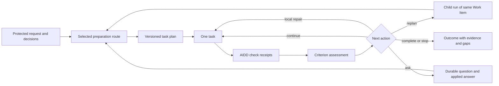

# Iterative delivery migration plan — 2026-10-01

## Status and decision summary

**Supersession recorded on 2026-10-01:** the operator selected a direct migration without
backward compatibility. [ADR 009](../architecture/iterative-delivery-decisions.md#adr-009-direct-breaking-replacement)
and the [unified target contract](../architecture/iterative-delivery-contract.md) replace
this proposal's classic/iterative coexistence, opt-in/default switch and later retirement
sequence. The original proposal below is retained as dated rationale; the roadmap/backlog
own revised task definitions and current status. Comparison uses the pinned earlier release
in a separate environment, not a legacy engine inside the replacement. Quality, native,
human-understanding, browser and installation gates are retained.

The user accepted recording this migration direction and task decomposition on
**2026-10-01**, based on repository revision `9eb2aad4` (`0.1.0a27.dev0`). All 39 local
tasks are now defined under W57–W59 in the canonical [roadmap](../backlog/roadmap.md).
The [backlog](../backlog/backlog.md) selects W57-E1-S1-T1 as Next and its two ready-afterward
successors as Soon. The remaining migration tasks are planned; none is completed by this
planning change.

Subsequent reconciliation on 2026-10-01: the user additionally requested durable product
positioning and a considered UI/UX direction. The roadmap added `W57-E1-S1-T3` as a separate
design precursor, making 40 tasks in W57–W59. The original 39-task decomposition below is
retained. [Product positioning](../product/product-positioning.md), the
[iterative UX blueprint](../architecture/iterative-operator-ux.md), and the
[audit/concept bundle](../design/iterative-operator/README.md) inform the contract and UI
tasks without implementing the migration. The roadmap owns their current status.

This dated document retains the accepted direction, decomposition, and design rationale;
the roadmap/backlog own current task definitions, dependencies, priority, and status.
W57-E1-S1-T1 must settle the normative contracts before behavior changes. This acceptance
does not implement the new workflow or replace existing release/beta acceptance gates.

Target outcome: an operator gives a delivery objective, sees a small set of concrete
behavior criteria and unresolved decisions, and gets an incremental implementation with
independently retained verification. Evidence can change the next action and the plan.
Reading and approving a generated specification is not the control mechanism.

The accepted decomposition contains **3 waves, 6 epics, 13 slices, and 39 local tasks**:

| Wave | Observable result | Tasks | Exit gate |
| --- | --- | ---: | --- |
| W57 — grounded requirements and owned verification | Claims are traceable to the request; task completion requires AIDD verification; semantic gaps stay visible. | 11 | A complete task demonstrably fails on false evidence and passes on actual required behavior. |
| W58 — bounded iterative delivery | Preparation depth is selected by policy; feedback can create a child run with a revised task plan and addressed invalidation. | 15 | Multi-iteration, recovery, and profile parity scenarios pass without synthetic stage success or lost history. |
| W59 — operator understanding and finite cutover | CLI/UI show outcome, decisions, changes, and proof; measured acceptance permits the default switch and subsequent classic retirement. | 13 | Current release candidate, real operator observations, defaults, formats, and installation guidance agree. |

The earlier estimate of 4–6 small PRs concerned a narrow proof of the first behavior/evidence
loop. It does not cover this complete migration. Task count is a decomposition, not a
calendar estimate or a requirement for exactly 39 PRs. Re-estimate implementation after
the W57 pilot and W58 storage/profile prototype, where the main integration risks become
observable.

## 1. Evidence and product problem

The [Habr retrospective](https://habr.com/ru/companies/haulmont/articles/1087664/) describes
a planning product whose generated specifications attracted little reading, whose guided
summary added another layer of text, and whose planning/execution split obstructed
iteration. This motivates testing operator understanding and continuous feedback rather
than maximizing document volume. It is one product retrospective, not proof that every
operator refuses every generated document.

The current repository has useful foundations: protected operator requests, Markdown
contracts, validation/repair, durable interviews, raw logs, task attempts, repository
snapshots, project-set attribution, and independent harness checks. Preserve these.
The migration addresses specific gaps:

| Current boundary | Consequence | Proposed change |
| --- | --- | --- |
| The normal workflow advances through `idea → research → plan → review-spec → tasklist → implement → review → qa`. | Even a bounded correction inherits preparation artifacts and a forward stage model. | Select a finite preparation route and permit evidence-driven child iterations. |
| `review-spec` sign-off is runtime-authored; it is not a human product decision. | Document agreement can be mistaken for authority about the requested behavior. | Track the source and authority of criteria/decisions explicitly. |
| Cross-document checks connect plan/tasklist/report structures more strongly than the original request. | Internally consistent documents can still describe the wrong outcome. | Ground links in the original request, answers, accepted decisions, and independent behavioral checks. |
| Some semantic evidence rules recognize path/ID-shaped references without dereferencing them. | A plausible locator can pass without a corresponding source. | Resolve identities, anchors, files, and digests; report missing evidence. |
| Implementation command/result text is largely a runtime claim; independent execution exists in the harness. | A written “pass” is not production verification. | Execute declared checks through a product verification service and retain AIDD-owned receipts. |
| Task ledgers bind one tasklist digest; shared work-item stage outputs are mutable projections. | A new plan can collide with old task identity and historical inputs. | Immutable run-scoped input snapshots and versioned task plans. |
| Current remediation reopens implementation in the same run, with a last-task fallback. | A finding is not reliably addressed to the affected task/dependency closure. | Address findings and preserve unaffected work, with explicit re-verification. |
| Studio primarily exposes stages and documents, with existing reading briefs and evidence views. | Another free-text summary would not establish understanding or evidence authority. | Extend those surfaces with deterministic criterion/task/change/proof projections. |

Relevant source owners are listed in section 11. The previously observed fabricated
review-spec locator passing semantic and cross-document checks was a validator-only
probe; it was not proof that every workflow gate accepts the same input.

## 2. Target behavior and authority

### Operator flow

1. Capture the protected request, constraints, project set, and initial repository identity.
2. Produce compact behavior criteria linked to exact source fragments. Mark ambiguous
   additions as proposals, with the concrete decision needed to resolve them.
3. Select preparation depth from explicit policy signals. Investigate uncertain ownership,
   dependencies, or verification before making a product assumption.
4. Execute one dependency-ready task with a bounded scope and task-local brief.
5. Run declared checks independently of runtime-authored reports. Record the code identity,
   outputs, and result, then assess what the result establishes about the criteria.
6. Choose `continue`, `repair`, `replan`, `ask`, or `stop` from current evidence and budgets.
7. Reconcile final checks on the final tree, review/QA findings, criterion coverage, and any
   explicit manual acceptance before reporting the delivery outcome.

The primary operator view answers: what behavior changes, what actually changed, what was
checked, what remains uncertain, and what decision/action is needed. Generated Markdown
and native logs remain available for inspect/source/compare and audit. Editing surfaces
apply to operator-owned requests, answers, and change inputs through their existing
authority services; generated stage outputs are read-only in the operator frontend.

### Authority rules

| Fact or artifact | Owner and meaning |
| --- | --- |
| Original request and operator answers | Operator-authored source; preserve consumed revisions. |
| Extracted criterion or task proposal | Runtime-authored Markdown, validated against source references; additions do not acquire product authority merely by being written. |
| Product decision | Explicit operator action persisted by AIDD, with actor, source/criterion identity, scope, and consequence. |
| Check definition | Registered configuration/operator/scenario definition with `authority_source`, digest, and durable registration event; model-authored tasklist/report commands are proposals, not execution authority. |
| Check receipt and lifecycle | AIDD-owned state plus readable Markdown projection; the runtime cannot author a passing receipt. |
| Semantic assessment | Attributed assessment against an oracle or explicit human decision; a model opinion stays a model opinion. |
| Runtime permission | Existing attempt-level execution authority; remains separate from product decisions. |

Explicit requirements already supplied by the operator do not need blanket re-approval.
Opening a document, clicking Launch/Resume, or approving a runtime permission does not
constitute product acceptance. Ask when a product ambiguity, conflict, unverifiable
requirement, or material scope/goal change requires a decision. A local repair, next task,
or internal decomposition change within the same authorized outcome does not require
another product approval just because a tasklist digest changed.

Reusing product authority requires unchanged source-backed criterion meaning, constraints,
non-goals, authorized project/scope boundaries, and decision/check authority. Validate a
new decomposition against those bounds. Changed task dependencies or task definitions
invalidate affected execution evidence; they do not automatically change product authority.
An ambiguous or conflicting equivalence mapping asks/stops rather than letting an LLM
certify that the outcome stayed the same.

The exact source-grounding rules must be conservative: a valid source link proves
referential integrity, not that a paraphrase has the same meaning. Behavioral oracles,
counterexamples, and explicit decisions cover that remaining gap.

### Criterion and proof model

Each criterion has a stable ID, exact request/answer/decision sources, expected observable
behavior, applicable constraints/non-goals, a negative example where relevant, and a
verification/assessment method. Revisions preserve identity when meaning is unchanged;
changed meaning invalidates affected authority and proof.

Keep three separate dimensions in read models and completion gates:

- **Authority:** explicit source-backed, proposed, unresolved/conflicting, or superseded.
- **Execution evidence:** passed, failed, not run, cancelled, timed out, stale, unavailable,
  or incompatible, with exact receipt identity.
- **Behavior assessment:** confirmed, rejected, inconclusive, or not assessed, with the
  named oracle/assessor and supporting evidence.

A process exiting zero does not establish every natural-language requirement. A valid
Markdown structure does not establish product correctness. A skipped check is not a pass.
All required criteria must have the configured verification/assessment disposition before
the system can claim completion; an unknown or human-dependent criterion remains explicit.
For a mandatory criterion, `not-assessed` or `inconclusive` prevents delivery completion.
The system may report stopped/partial with the gap, never silently downgrade the criterion.
Implementation-stage success and final Work Item delivery completion are separate gates.

An independent oracle records its source, owner, version/digest, and sealing before
implementation. A generated specification, test, review, or grader from the same delivery
chain cannot be its own independent answer key. New proposed checks can provide useful
execution evidence without automatically establishing semantic correctness. Manual
acceptance is an attributed operator decision on the criterion and current evidence.

Receipts bind Work Item/run/stage/task/attempt/execution IDs, criterion/check-definition
revisions and digests, command, normalized cwd/project set, tree digest, config/oracle/tool
identity, timeout/cancel/exit status, timestamps/duration, and stdout/stderr references.
The declared-input manifest covers relevant ignored/generated verification inputs beyond
the normal Git/untracked snapshot. Harness transcripts remain eval evidence; sharing a
process-execution seam does not make a harness transcript a product receipt.

## 3. Workflow and persistence design

### Profiles and preparation routes

During migration, `classic` and `iterative` are two actively supported **current** profiles.
The profile, policy version, selected route, required contracts, runtime selectors, and
budgets are pinned when creating a run. A continuation cannot silently change them.
Classic uses the current schemas; it is not a reader or fallback for old persisted formats.

The iterative profile uses a small set of finite routes, not an arbitrary graph platform:

| Route | Illustrative stage selection | Selection condition |
| --- | --- | --- |
| Focused | compact `idea → tasklist → implement → review → qa` | Bounded scope, sufficient source authority, known checks, no material unresolved decision. |
| Investigate | compact `idea → research → tasklist → implement → review → qa` | Concrete repository/verification uncertainty that research can resolve. |
| Design | `idea → research → plan → review-spec → tasklist → implement → review → qa` as needed | A recorded design/interface/scope decision needs explicit analysis. |
| Correction | revised or reused task plan, then `implement → review → qa` | A child iteration has valid pinned prerequisites and an addressed finding. |

Stage identifiers and useful stage implementations can be reused. The universal
eight-stage chain, contiguous-bound selection, and “8 of 8” progress assumption cannot
remain the only executable policy. Profile contracts must state what replaces each
omitted prerequisite. Never synthesize a successful skipped stage or an empty specification
to satisfy an old validator. Actual operation lists and criterion states determine progress.
Persist selected operations and their predecessor/input map. Represent `not-selected` as
a projection disposition, separate from successful execution and terminal stage state.

Policy selection uses declared scope, unresolved source decisions, ownership discovery,
available oracles/checks, material interface effects, and current findings. It cannot route
from an LLM confidence score or provider/model name. Uncertain classification escalates
investigation or a question. No additional operator “planning mode” is needed.

### Iteration as a child run of the same Work Item

Use a new child run with a new `run_id` for a changed plan/tasklist or addressed replan,
keeping the same delivery objective and Work Item lineage. This reuses run lifecycle,
provenance, and task execution without repeatedly redefining terminal stage states inside
one run. A retry/repair/resume
with unchanged run inputs remains a continuation of that run.

The existing `next_flow` creates a new Work Item after a terminal flow; it is not the
same-objective iteration mechanism. New objectives use the existing explicit follow-up
semantics. Implement a separate same-Work-Item child-run service.

Each child has a parent reference, iteration number, decision/evidence references,
selected operations, source artifact hashes, plan revision, tasklist hash, invalidation
scope, profile identity, and inherited objective budget counters. Runtime-authored stage
content stays Markdown. Manifests, ledgers, receipts, events, and native logs retain their
appropriate AIDD-owned machine/raw formats with readable projections where required;
these lifecycle identities are not model-authored JSON.

Before activating a child, stop the predecessor's execution and validate terminal/current
source state. Retain workspace mutation ownership across snapshot validation and child
publication, then hand the lease to the child atomically; an intervening writer must not
change the checkout between those operations. A failed or blocked predecessor can supply only
specifically validated artifacts and task evidence; failed output does not become trusted
because it belongs to the parent. The parent and consumed snapshots are immutable.
One checkout has one mutating flow lease; automatic parallel child execution is excluded.

Every stage/task reader must resolve artifacts for an exact run. Shared work-item output
paths may remain active projections, but are not historical source authority. Publication
of a revised plan, child ledger, lineage, and active projection must be atomic or recoverable
with an explicit incomplete state; a crash cannot produce mixed-parent inputs.
Runtime-facing documents use a run-local staging root. Retain the parent's committed
work-item projection while a child result is uncommitted; inspecting the selected child
uses its exact-run artifacts. Promote a coherent child result bundle only after validation
and commit, with durable prepared/executing/validated/committed publication phases.
Blocked or crashed partial output cannot overwrite the committed parent projection.

### Addressed invalidation and carry-forward

Compute `finding → criterion/task IDs → dependency closure → affected proof/review/QA`.
Use explicit revision mappings for retained, changed, removed, and new tasks. Identity
comparison includes task definition, constraints, criterion meaning, scope, dependencies,
check definitions, and source provenance; matching task IDs alone is insufficient.

Unchanged work can carry forward with retained source-attempt references if its changes
remain present and its dependencies/criteria remain valid. Display this as reused work,
not as a newly executed successful attempt. Re-run checks without re-running the model
when proof is stale. A receipt from an earlier whole-tree identity cannot prove the new
final tree merely because the task appears unrelated. Aggregate finalization verifies all
required checks on the final tree, including after finalization changes.

### Bounded recovery

Distinguish document repair, runtime retry, answer continuation, implementation fix,
verification rerun, and plan iteration. Define which attempts consume which counters.
Child creation cannot reset the Work Item iteration/time/cost budgets. Repeated equivalent
findings, no-progress revisions, exhausted budgets, incompatible evidence, and ambiguous
scope have explicit stop/question behavior. Preserve first decisive failure and raw logs.

Cancellation/interruption stores partial receipts and terminal process ownership. Restart
reconciles the existing attempt before rerunning a command or creating another child.
No automatic duplicate execution after a crash.
Child creation has a stable decision ID and idempotency key binding parent run, decision,
source evidence digest, and profile/policy revision. A durable decision-to-child index and
budget reservation/iteration debit commit once; actual elapsed/cost accounting reconciles
once. Retrying creation returns the same child or an explicit incomplete transaction.
Each verification execution has its own receipt/execution ID and recovery policy.

### Artifact and prompt preservation matrix

| Content | Current classic during transition | Iterative target |
| --- | --- | --- |
| Stage content and role prompts | Current eight-stage contracts/prompt roles with aligned authority/evidence additions. | Only selected stages, with compact outcome/task/finding content; optional design analysis has a recorded purpose. |
| Research/plan/review-spec | Required by the classic route. | Produced only when selected; omitted stages have no fabricated outputs. |
| System/run/repair/interview/intervention instructions | Preserve applicable control behavior. | Preserve the same durable control requirements with profile-specific input routing; share instructions rather than duplicating them. |
| Stage result, validator report, repair brief, questions/answers | Preserve as required control evidence. | Preserve for executed operations/repair/questions according to their contracts. |
| Task ledger, owned receipts, source snapshots, raw logs | Retain current-format proof and provenance. | Retain per task/run/iteration with exact source identity. |
| Repeated narrative summaries/tours | Existing presentation serves the comparison baseline. | Remove redundant narrative requirements; deterministic criterion/change/proof navigation is primary. |

## 4. Wave W57 — grounded requirements and owned verification

Primary stories: US-02, US-03, US-04, US-05, US-07, US-10, US-13.
The pilot still runs through the current classic workflow; it establishes truth and proof
before changing orchestration. Each behavior task includes contract/prompt alignment and
its direct regression; the final scenario task integrates these results rather than
postponing their tests.

### Epic W57-E1 — source and decision authority

#### Slice W57-E1-S1 — define the target and comparison contract

**W57-E1-S1-T1 — Define outcome, authority, profile, and iteration contracts.**

- Output: accepted architecture decision, ownership matrix, story changes, and stage/profile
  contract migration map for sections 2–3, including current-format retirement policy.
- Scope: product/architecture/compatibility docs, document ownership, traceability registry;
  no runtime implementation. Clarify US-13 “approved tasklist” authority and US-11 routes.
- Dependencies: none.
- Verification: documentation/traceability consistency; review that material decisions,
  permissions, model reviews, and ordinary retries have distinct consequences.

**W57-E1-S1-T2 — Pin the baseline and predeclare migration acceptance.**

- Output: comparison protocol, fixed tasks/fixtures, independent expected behavior,
  failure taxonomy, comprehension questions, and proposed thresholds from section 8.
- Scope: eval/E2E protocols and baseline inventory. Retain current classic traces; record
  model/runtime/reasoning, prompts, commit, environment, and bundle identity.
- Dependencies: W57-E1-S1-T1.
- Verification: both profiles can be evaluated against the same task/oracle without
  using generated plans as the answer key; missing baseline evidence stays unavailable.

#### Slice W57-E1-S2 — ground criteria and applied answers

**W57-E1-S2-T1 — Add source-bound criteria and scoped product decisions.**

- Output: compact Markdown criterion proposal plus AIDD-owned authority/decision records,
  stable source anchors/digests, revision identity, and eligibility for unresolved decisions.
- Scope: document contracts/ownership, core source/decision services, validation context,
  and minimal CLI question/decision integration; protect operator-authored originals.
- Dependencies: W57-E1-S1-T1.
- Verification: explicit criteria continue without blanket approval; proposed additions
  and conflicts block; runtime permission, document opening, and model sign-off cannot
  confer product authority; stale source decisions are detected. Decomposition changes
  reuse authority only within unchanged criterion/constraint/authorized-scope bounds;
  ambiguous equivalence blocks without model self-certification.

**W57-E1-S2-T2 — Dereference evidence paths, IDs, and criterion coverage.**

- Output: deterministic reference resolution across request, criteria, plan/tasklist,
  review-spec, implementation, review, and QA, with precise missing/stale findings.
- Scope: `validators/cross_document_rules`, semantic evidence rules, source context and
  fixtures; load consumed protected request/answer/criterion/decision revisions into
  context. Pin those revisions in the current run, then adopt the unified resolver in
  W58-E1-S2-T2. Implement locator identity/bounded fragments, not NLP truth heuristics.
- Dependencies: W57-E1-S2-T1.
- Verification: nonexistent file/line/ID, changed digest, unrelated ID, and internally
  consistent documents omitting an original constraint cannot produce complete coverage.

**W57-E1-S2-T3 — Track answer application through decisions and behavior.**

- Output: QID → answer revision → affected criteria/tasks → resulting evidence mapping;
  distinguish recorded, linked, and actually assessed application.
- Scope: interview consistency, input compiler, criterion revisions, question projections,
  and focused CLI fixtures. Add no duplicate free-text summary requirement.
- Dependencies: W57-E1-S2-T1, W57-E1-S2-T2.
- Verification: resolving a QID without applying the answer leaves a coverage/assessment
  gap; changed answers invalidate affected criteria; unrelated criteria stay intact.
  A correct QID link with unchanged wrong behavior passes link integrity but is rejected
  or remains inconclusive under behavioral assessment; linking alone cannot prove application.

### Epic W57-E2 — product-owned verification and honest acceptance

#### Slice W57-E2-S1 — declare, execute, and bind checks

**W57-E2-S1-T1 — Register declared check definitions and execution policy.**

- Output: typed check registry with stable IDs, exact command/argv or declared shell form,
  cwd/project ownership, timeouts, expected result, prerequisites, `authority_source`,
  definition registration event and authority digest; include a declared-input manifest.
- Scope: configuration boundary, check-definition Markdown/current state, project-set
  policy, task criterion references, doctor/preflight, and deterministic fixtures.
- Dependencies: W57-E1-S1-T1, W57-E1-S2-T1.
- Verification: runtime report text cannot register/execute a new command; undeclared cwd,
  incompatible configuration, changed check definitions, and absent prerequisites stop
  explicitly. Model-authored tasklist verification is also a proposal until registered
  under authorized policy. Test full-access/brokered distinctions honestly.

**W57-E2-S1-T2 — Execute checks through AIDD and retain check receipts.**

- Output: application verification service with an injected execution port, process
  ownership, stdout/stderr, exit/timeout/cancel status, duration, and sealed receipt.
- Scope: shared narrow process infrastructure, application composition, core lifecycle,
  receipt retention, and direct executor fixtures. Keep this task centered on the product
  execution/receipt lifecycle; wire CLI/task gates in W57-E2-S2-T1 and harness scenarios in
  W57-E2-S2-T3. Do not import harness orchestration into product core.
- Dependencies: W57-E2-S1-T1.
- Verification: false “pass” reports, all-skipped checks, timeout, cancellation, missing
  executable, and interrupted process retain truthful results and block required progression.
  A substituted harness transcript cannot satisfy the product receipt gate.

**W57-E2-S1-T3 — Bind proof to code, check, source, and environment identity.**

- Output: freshness policy for tree content including uncommitted/untracked inputs,
  applied answer/criterion/check/config digests, cwd/project set, and declared lock/tool/
  environment/ignored/generated inputs, with the receipt identity defined in section 2.
- Scope: repository evidence, receipt schema, freshness service, finalization publication,
  and non-Git/declared generated-input fixtures. Avoid exposing secrets in environment logs.
- Dependencies: W57-E1-S2-T2, W57-E1-S2-T3, W57-E2-S1-T2.
- Verification: stale code, modified test/oracle, replaced checkout, changed criterion,
  check/cwd/config, and required ignored input invalidate proof. Classify verification
  byproducts so output generation does not spuriously alter product identity.

#### Slice W57-E2-S2 — gate task and delivery outcomes

**W57-E2-S2-T1 — Require owned verification for task and finalization success.**

- Output: task gate and final aggregate gate; reports distinguish runtime claims from
  observed receipts, and required checks run on the final implementation tree. Separate
  implementation-stage success from downstream Work Item delivery acceptance.
- Scope: task attempt executor, ledger, aggregate finalizer, stage reconciliation,
  CLI task/run output, implementation validators, and repair accounting.
- Dependencies: W57-E2-S1-T3.
- Verification: a structurally valid implementation report with no/currently failing
  receipts cannot succeed; fixes can resume the affected task; finalization changes require
  fresh aggregate checks; prior successful evidence remains retained.

**W57-E2-S2-T2 — Separate execution success from behavioral acceptance.**

- Output: criterion assessment contract and completion policy referencing independent
  expected behavior, counterexamples, regression oracles, or explicit manual acceptance;
  oracle source/owner/version/digest is sealed before implementation.
- Scope: review/QA contracts, assessment service, core delivery completion, graders,
  semantic rules, and honest operator labels. Model conclusions retain attribution.
- Dependencies: W57-E1-S1-T2, W57-E1-S2-T3, W57-E2-S2-T1.
- Verification: code/tests/documents agreeing on the wrong behavior fail the independent
  oracle; exit zero alone cannot confirm a subjective criterion; red-before/green-after
  regression evidence demonstrates that a check detects the relevant defect. Inconclusive/
  unassessed mandatory criteria permit only a stopped/partial outcome, never complete.

**W57-E2-S2-T3 — Demonstrate the complete grounded task pilot.**

- Output: installed deterministic positive/negative scenarios spanning request → criterion
  → task → diff → receipt → assessment, with retained audit bundles and grader verdicts.
- Scope: deterministic scenarios/harness/evals and pilot evidence report. Adapt the pinned
  Hono non-error-throw behavior as one oracle without requiring a live provider for this gate.
- Dependencies: W57-E2-S2-T2.
- Verification: section 7 truth/authority cases produce the expected first decisive
  failure; an actual correct change passes; evidence inspection agrees with exit status.

## 5. Wave W58 — bounded iterative delivery

Primary stories: US-01, US-03, US-04, US-05, US-08, US-10, US-12, US-13.
Keep classic behavior current during opt-in development. Change graph consumers and input
resolution deliberately; adding a child-run link while retaining mandatory eight-stage
preparation would leave the main product problem unresolved.

### Epic W58-E1 — profile identity and immutable plan revisions

#### Slice W58-E1-S1 — make preparation policy explicit

**W58-E1-S1-T1 — Persist profile, route, policy, and objective budgets.**

- Output: explicit current-format run identity for classic/iterative, selected operations,
  profile contract versions, runtime selectors, provenance, and inherited budgets.
- Scope: `config.py`, run/store/manifest models, workflow/stage entrypoints, preflight,
  installed resource selection, and continuation identity checks.
- Dependencies: W57-E1-S1-T1, W57-E2-S2-T3.
- Verification: profile/config changes cannot alter an existing continuation; missing or
  unsupported format stops; current-format classic works during coexistence but old schemas
  cannot select it as a compatibility fallback. Model/provider choices stay in configuration.

**W58-E1-S1-T2 — Resolve stage contracts and dependencies per profile.**

- Output: finite executable routes, profile input/output/ownership contracts, and updated
  registry/eligibility/publication consumers; selected operation/predecessor maps and
  `not-selected` dispositions replace the universal contiguous-stage requirement.
- Scope: stage manifests/graph/registry/preparation, validators, packaged contracts,
  `workflow_service.py`, `cli/run.py`, `cli/stage_run.py`, `cli/ui.py`, read models,
  direct-stage/run parity, and scenario declarations.
- Dependencies: W58-E1-S1-T1.
- Verification: focused route runs without research/plan/review-spec output; omitted
  prerequisites have explicit substitutes; no skipped stage is marked succeeded; design
  and classic routes retain their declared requirements.

**W58-E1-S1-T3 — Select preparation depth from deterministic evidence signals.**

- Output: policy selector and durable route rationale for focused/investigate/design;
  escalation and question behavior for uncertain ownership or missing verification.
- Scope: small core policy service, preflight/input discovery, next-action baseline,
  config policy settings, and table-driven scenarios.
- Dependencies: W58-E1-S1-T2, W57-E1-S2-T3, W57-E2-S2-T2.
- Verification: bounded bug fix avoids full preparation; unknown interface effects invoke
  investigation/design; material ambiguity asks; free confidence/provider names cannot
  downgrade preparation. Every route retains completion gates.

#### Slice W58-E1-S2 — version inputs and preserve reusable work

**W58-E1-S2-T1 — Version task plans and require explicit revision mappings.**

- Output: immutable Markdown task plan revision, retained/changed/removed/new mappings,
  stable criterion/task references, and fingerprints of task meaning and execution scope.
- Scope: tasklist contracts/parser, ledger initialization, source mismatch handling,
  fixtures and targeted planning prompts. Keep the current plan immutable in each run.
- Dependencies: W58-E1-S1-T2, W57-E1-S2-T2.
- Verification: duplicate/ambiguous mappings stop; same ID with changed scope/criterion is
  treated as changed; an in-place tasklist edit cannot silently redefine a running ledger.
  Revision checks enforce the unchanged product authority bounds without requiring
  re-approval solely for a dependency/decomposition change.

**W58-E1-S2-T2 — Resolve all consumed artifacts from immutable run snapshots.**

- Output: exact-run input resolver and publication/index semantics for current outputs,
  parent sources, source digests, run-local runtime staging roots, and active projections;
  durable publication phases and coherent validated bundle commit.
- Scope: stage/task preparation and readers, finalization eligibility, stage outputs,
  run inspection/artifact index, and source snapshots; include failed/blocked sources.
- Dependencies: W58-E1-S1-T1, W58-E1-S2-T1.
- Verification: different runs in one Work Item consume different tasklists safely; latest
  publication cannot alter historical inputs; missing/stale/failed parent artifacts are
  rejected; crash recovery never combines half-published revisions. Uncommitted or blocked
  child documents leave the committed parent projection intact.

**W58-E1-S2-T3 — Invalidate affected tasks and carry forward verified work.**

- Output: finding-to-task dependency closure and revision-specific ledger initialization
  with an explicit executed/reused disposition, immutable source-run/task-attempt/digest
  references, task fingerprints, retained work, and required re-verification.
- Scope: task plan/ledger/evidence, repository snapshots, task read model, and finalization;
  revise ledger completion predicates deliberately rather than equating reuse to an attempt.
- Dependencies: W58-E1-S2-T1, W58-E1-S2-T2, W57-E2-S1-T3.
- Verification: changed criterion/task and dependents rerun; independent work remains
  attributable; stale whole-tree proof reruns checks; absent retained code or ambiguous
  finding prevents reuse. Reused work cannot satisfy final proof without required checks
  on the new final tree. No blind “reopen last task” in the iterative path.

### Epic W58-E2 — bounded controller and task-local context

#### Slice W58-E2-S1 — implement the evidence-driven control loop

**W58-E2-S1-T1 — Create child iterations through a bounded controller.**

- Output: `continue/repair/replan/ask/stop` decision service and same-Work-Item child-run
  creation with sealed predecessor, source authority, invalidation, and atomic lease
  handoff; stable decision/idempotency identity and durable decision-to-child index.
- Scope: workflow service, child-run application service, run/store/attempt lineage,
  decision records and deterministic controller scenarios; no adapter policy branches.
- Dependencies: W58-E1-S1-T3, W58-E1-S2-T2, W58-E1-S2-T3, W57-E2-S2-T2.
- Verification: execution proof changes the next action; valid failed/blocked/succeeded
  sources are handled deliberately; active or malformed parent is rejected; limits stop
  repeated replans; unrelated task successes and parent evidence remain intact.

**W58-E2-S1-T2 — Reconcile crash, cancellation, questions, and budget accounting.**

- Output: explicit lifecycle/accounting rules for repair, retry, answer continuation,
  verification, fix, and iteration, including no-progress detection and partial receipts.
- Scope: attempt lineage, owned process lifecycle, leases/jobs, recovery/reconciliation,
  budget provenance, and failure classification.
- Dependencies: W58-E2-S1-T1.
- Verification: injected crashes around command completion and child publication do not
  double-execute or reset budgets; resumed questions use current answers; cancellation
  leaves truthful terminal state and first decisive failure evidence. Crashes before/after
  manifest/index commit return the same child or explicit incomplete transaction;
  iteration debit and actual receipt cost/time accounting happen once.

**W58-E2-S1-T3 — Route remediation and feedback to the affected iteration.**

- Output: profile-aware correction/change service shared by run/stage/task/CLI/UI paths;
  distinguish same-plan fix, replan, product change, and new-objective follow-up.
- Scope: remediation/intervention/next-flow/application entrypoints, request documents,
  task routing and core/CLI regressions. Preserve classic behavior during coexistence.
- Dependencies: W58-E2-S1-T2, W58-E1-S2-T3.
- Verification: review/QA findings address exact tasks; forbidden stage intervention does
  not bypass downstream authority; feedback cannot silently expand the objective; unchanged
  authorized corrections do not add blanket approval; source lineage survives follow-up.

#### Slice W58-E2-S2 — deliver compact context without a summary cascade

Change one workload prompt group at a time. For every task below, keep model/provider/
reasoning, scenario, and other prompt groups pinned; compare representative traces before
and after. Group-specific regressions belong in the same task.

**W58-E2-S2-T1 — Compile task-local briefs from exact source artifacts.**

- Output: deterministic bounded brief containing the selected criterion, scope,
  dependencies, constraints, current finding, declared checks, and exact source locators.
- Scope: application/stage preparation, task attempt executor, prompt assembly/provenance,
  and fixture traces. Full sources remain inspectable rather than copied into every prompt.
- Dependencies: W58-E1-S2-T2, W58-E1-S2-T3, W57-E1-S2-T3.
- Verification: required constraints/answers survive compaction; stale input cannot be
  substituted; task context excludes unrelated reports while preserving source identity.

**W58-E2-S2-T2 — Adapt intake and discovery prompts to criterion-first outputs.**

- Output: lean idea/research role prompts and profile outputs centered on outcome,
  source evidence, concrete unknowns, and decisions; detailed discovery only when selected.
- Scope: intake/discovery prompt packs, document examples/contracts and pinned trace/eval
  comparisons. Change individual stage prompts sequentially within this workload group.
- Dependencies: W58-E2-S2-T1, W58-E1-S1-T3.
- Verification: explicit constraints stay visible; unsupported product assumptions create
  questions/proposals; focused runs do not produce a mandatory long research narrative.

**W58-E2-S2-T3 — Adapt planning prompts to bounded versioned task cards.**

- Output: tasklist/optional design review prompts with criterion IDs, task-local proof,
  revision mapping, and only necessary design decisions; no unconditional full specification.
- Scope: planning prompt group, plan/review-spec/tasklist contracts/examples and trace
  comparisons, with intake/delivery prompts pinned.
- Dependencies: W58-E2-S2-T1, W58-E1-S2-T1, W58-E2-S2-T2.
- Verification: focused and design routes both yield executable coverage; replans retain
  identity correctly; concise output does not omit dependencies, boundaries, or checks.

**W58-E2-S2-T4 — Adapt implementation prompts to task changes and attributed claims.**

- Output: lean task execution/finalization instructions and reports pointing to owned
  receipt IDs, changed paths, residual gaps, and scope violations.
- Scope: implementation prompt group and Markdown report contracts/examples; preserve
  existing runtime capabilities and model defaults.
- Dependencies: W58-E2-S2-T1, W58-E2-S2-T3, W57-E2-S2-T1.
- Verification: a task-local trace applies its criterion and constraints; model text
  cannot fabricate an AIDD receipt or enlarge check/project authority.

**W58-E2-S2-T5 — Adapt review and QA prompts to criterion assessments and findings.**

- Output: attributed, addressable findings and assessments against original criteria,
  current changes, and check evidence; distinguish observations from proposed conclusions.
- Scope: review/QA prompt group, document contracts, graders and pinned trace comparisons.
- Dependencies: W58-E2-S2-T4, W57-E2-S2-T2.
- Verification: wrong but internally consistent code is rejected by the oracle; review
  gives criterion/task locators usable for replan; missing proof remains inconclusive.

#### Slice W58-E2-S3 — prove integrated iteration and portability

**W58-E2-S3-T1 — Demonstrate profile, iteration, and recovery conformance.**

- Output: installed deterministic scenario matrix for all routes, multi-iteration
  correction/replan, carry-forward/re-verification, failed/blocked sources, and classic parity.
- Scope: harness/scenarios/evals, fake-runtime conformance and packaged-resource fixtures.
- Dependencies: W58-E1-S2-T3, W58-E2-S1-T1, W58-E2-S1-T2, W58-E2-S1-T3,
  W58-E2-S2-T5.
- Verification: section 7 lifecycle/boundary cases and nearest core/application/CLI checks
  pass; raw runtime/verification logs and final evidence are inspected; orchestration
  policy has no provider-specific branch or newly enabled multi-agent requirement.

## 6. Wave W59 — operator understanding and finite cutover

Primary stories: US-05, US-06, US-07, US-09, US-10, US-11, US-13.
Extend the existing Studio/Inbox/History and core next-action services. UI must not invent
eligibility, infer proof from prose, or require a Spec Tour before routine execution.

### Epic W59-E1 — outcome, decision, and history surfaces

#### Slice W59-E1-S1 — make outcome and proof the primary view

**W59-E1-S1-T1 — Project criterion coverage and one authoritative next action.**

- Output: shared core payload `source → criterion → task → change → receipt → assessment`,
  with unknown/stale states, exact locators, selected operations, and scoped decision/action.
- Scope: operator read models, reports/Inbox/next action, task projections, application DTOs.
- Dependencies: W58-E2-S3-T1.
- Verification: projection derives from persisted facts; partial coverage cannot become
  “verified”; required decision, runtime permission, question, and failed check remain
  distinct blockers; reused work is not displayed as a new successful attempt.

**W59-E1-S1-T2 — Expose outcome, proof, and scoped decisions through CLI.**

- Output: inspect/decide/change commands and truthful run/task summaries using the shared
  application services, with durable decision readback and exact evidence navigation.
- Scope: CLI run/stage/task surfaces and focused tests; retain logs/artifacts inspection.
- Dependencies: W59-E1-S1-T1.
- Verification: same cases as UI yield the same blocker/action/outcome; stale and repeated
  decisions have explicit conflict/idempotency behavior; product decisions do not mask
runtime permission, unanswered questions, or failing receipts.

**W59-E1-S1-T3 — Render criterion, change, and proof cards in Operator UI.**

- Output: primary outcome view showing before/after behavior, affected tasks/diff,
  actual checks, uncertainty, and needed decision; dynamic operation navigation/progress.
- Scope: existing Studio components/static assets, payload consumers, DOM/browser fixtures.
- Dependencies: W59-E1-S1-T1.
- Verification: representative focused/design/correction routes have truthful progress;
  one primary action comes from core; source/diff/receipt/log opens exact retained evidence;
  no mandatory generated prose tour or second planning mode appears.

**W59-E1-S1-T4 — Show how an answer or change request affected delivery.**

- Output: operator feedback/answer surfaces linked to criterion revision, affected tasks,
  child decision, resulting change/check, and any remaining application gap.
- Scope: existing question/change/recovery forms, CLI readback, shared change service,
  source comparison and UI projections.
- Dependencies: W59-E1-S1-T2, W59-E1-S1-T3, W58-E2-S1-T3.
- Verification: an ignored answer is visible as a gap; material change asks for scoped
  authority; ordinary correction preserves prior authority; no action silently expands
  project set or loses authored feedback after navigation.

#### Slice W59-E1-S2 — preserve identity across time and navigation

**W59-E1-S2-T1 — Join criteria, plan revisions, decisions, and iterations in History.**

- Output: timeline/Filmstrip and CLI inspection for parent/child runs, criterion/plan diffs,
  reused attempts, decisions, receipts, assessments, and stale/downstream consequences.
- Scope: existing History/Compare/artifact-index read models and browser fixtures.
- Dependencies: W59-E1-S1-T4, W58-E1-S2-T2, W58-E2-S3-T1.
- Verification: history reads exact snapshots and shows unavailable evidence honestly;
  latest work-item files cannot reconstruct old state; runtime permissions remain separate.

**W59-E1-S2-T2 — Preserve project and job authority across iteration transitions.**

- Output: correct originating project/run/child context in background jobs, Inbox,
  refreshes, links, mutation guards, and cancellation/resume surfaces.
- Scope: UI job/context routing and existing stale-response protections, CLI parity,
  DOM/browser journey regressions; preserve selected model/reasoning propagation.
- Dependencies: W59-E1-S1-T4, W59-E1-S2-T1.
- Verification: switching project or active iteration while a job runs cannot apply an
  old decision to a new run; stale responses cannot render completion or enable a mutation;
  task, question, approval, review/QA, and recovery journeys still work.

### Epic W59-E2 — acceptance, default switch, and retirement

#### Slice W59-E2-S1 — measure correctness and understanding

**W59-E2-S1-T1 — Compare pinned classic and iterative native-runtime runs.**

- Output: paired evidence bundles and independent product-quality report for bounded
  fix, ambiguous requirement, design change, and correction/replan cases. Pin target repo
  commit, fixture/oracle, runtime/model/reasoning and environment across variants; record
  exact AIDD/prompt revisions and intentional profile/prompt differences separately.
- Scope: existing manual live E2E manifests/catalog/rubric and maintained runtime lanes.
  Follow `live-e2e` for authorized execution; do not change models/prompts/pins to rescue
  one side of the comparison. Native behavior evidence is separate from fake-runtime tests.
- Dependencies: W57-E1-S1-T2, W58-E2-S3-T1, W59-E1-S2-T2.
- Verification: original requirements and counterexamples determine quality; cost/time,
  reading burden, first verified change, failures, and interventions are recorded. Tier 1
  defects block release; other tiers retain their existing policy and explicit caveats.

**W59-E2-S1-T2 — Observe real operators using the new outcome flow.**

- Output: uncoached task observations and paired comprehension report with confusion,
  wrong actions, assistance, exact decision/evidence understanding, and follow-up findings;
  matched fixtures, pinned runtime/model/environment, and counterbalanced observation order.
- Scope: existing observed-acceptance protocol and anonymized retained evidence. Reconcile
  W42-E7-S2-T3 and W36-E7-S3-T2/T3 rather than duplicating or silently closing them.
- Dependencies: W57-E1-S1-T2, W58-E2-S3-T1, W59-E1-S1-T3, W59-E1-S1-T4,
  W59-E1-S2-T2.
- Verification: genuine participants explain section 8 questions and complete recovery;
  scripted browser replay does not count. Missing participants/environment are outstanding
  evidence, not a pass. A beta claim still requires its broader existing readiness gate.

**W59-E2-S1-T3 — Audit the exact candidate and decide cutover readiness.**

- Output: go/no-go report tying correctness, human observations, failure taxonomy,
  deterministic/browser evidence, runtime tiers, known gaps, and thresholds to one candidate.
- Scope: eval aggregation and acceptance docs; fixes return to the owning accepted task
  with new evidence, not a threshold rewrite or silent baseline replacement.
- Dependencies: W59-E2-S1-T1, W59-E2-S1-T2.
- Verification: all hard gates in section 8 are met with inspectable evidence, or report
  an explicit no-go and retain opt-in. Decide classic removal timing before default cutover.

#### Slice W59-E2-S2 — finish the migration in current formats

**W59-E2-S2-T1 — Validate installation and operator guidance for the candidate.**

- Output: packaged contracts/prompts/UI, clean pipx/uv-tool candidate evidence, doctor
  behavior, and README/handbook/config/current-format migration instructions.
- Scope: packaging/resources, distribution/release docs, install harness and checklists;
  local candidate preparation does not authorize external publication.
- Dependencies: W59-E2-S1-T3.
- Verification: installed tool runs the same scenarios and UI as the source candidate;
  no resource lookup depends on checkout-only paths; instructions explain authority,
  receipts, iteration, historical evidence, and explicit unsupported-format stops.

**W59-E2-S2-T2 — Make iterative the default for new runs.**

- Output: current default policy and explicit temporary classic selection, pinned per run,
  with bounded rollback for new run creation and an announced removal release/gate.
- Scope: configuration/default routing, provenance, CLI/UI launch, docs and regressions.
- Dependencies: W59-E2-S1-T3, W59-E2-S2-T1.
- Verification: new unqualified runs select iterative; existing current-profile runs keep
  identity; rollback affects new runs only. No old artifacts/manifests are rewritten and
  no resumability is promised across incompatible engine/format versions. The accepted
  cutover decision names the removal release/gate; classic supports only current schemas.

**W59-E2-S2-T3 — Retire classic execution and unsupported format consumers.**

- Output: iterative becomes the sole current delivery policy after the accepted transition
  gate; remove retired profile implementation, selectors, aliases, and obsolete readers.
- Scope: core/application/CLI/UI/resources/tests plus explicit changelog/compatibility notes.
- Dependencies: W59-E2-S2-T2 and the accepted classic-removal gate from W59-E2-S1-T3.
- Verification: current inputs pass; retired inputs stop clearly; source/resource scan
  finds no retired executable consumers. Raw historical evidence remains available for
  direct/archive inspection; recreation is deliberate, not a silent format conversion.

**W59-E2-S2-T4 — Seal final migration and release-readiness evidence.**

- Output: reconciled stories/traceability/roadmap, final current-format deterministic and
  browser/native acceptance, install evidence, release notes, and outstanding limitations.
- Scope: final installed candidate and documentation; use `release-publish` only if actual
  publishing is subsequently requested. Do not label the alpha beta-ready by inference.
- Dependencies: W59-E2-S2-T3.
- Verification: `make check`, `make test-browser`, required runtime/installation lanes and
  candidate evidence agree on the exact final revision; distinguish unrun/blocked checks
  from passed ones. A release after removal requires fresh final-candidate evidence.

## 7. Required adversarial acceptance matrix

These cases belong to the owning implementation tasks, then appear in integration
scenarios. Passing only a happy-path flow is insufficient.

| Case | Required observable result | Main owning tasks |
| --- | --- | --- |
| Nonexistent file, line, or milestone cited by review-spec | Invalid source finding; repair/stop; no complete coverage. | W57-E1-S2-T2 |
| All generated docs agree but omit a user constraint | Coverage gap or independent behavioral rejection. | W57-E1-S2-T2, W57-E2-S2-T2 |
| Question answered but implementation ignores it | Linked/application states remain distinct; criterion fails or is unassessed. | W57-E1-S2-T3 |
| Runtime report says pass; command never ran or failed | No passing owned receipt; task cannot succeed. | W57-E2-S1-T2, W57-E2-S2-T1 |
| All required checks skipped, unavailable, or cancelled | Explicit non-pass outcome and next action. | W57-E2-S2-T1 |
| Test exits zero but encodes the same wrong assumption as code | Independent oracle/counterexample rejects behavior. | W57-E2-S2-T2 |
| Check/test/oracle weakened during implementation | Changed authority/fingerprint invalidates proof; no self-authorized weakening. | W57-E2-S1-T3 |
| Code, untracked input, cwd, criterion, or checkout changed | Proof stale/incompatible; rerun or stop before completion. | W57-E2-S1-T3 |
| Required ignored/generated input changed | Declared input identity detects it; unknown input is a visible gap. | W57-E2-S1-T3 |
| Check output creates a generated byproduct | Correctly classify it; do not misreport unrelated source drift. | W57-E2-S1-T3 |
| Focused route has no research/spec output | Route succeeds only with its actual contracts; no synthetic stages. | W58-E1-S1-T2 |
| Same task ID now means different behavior | Invalidate changed task and dependents; no false reuse. | W58-E1-S2-T3 |
| Independent task is retained after replan | Work remains linked to source; stale proof refreshes on current/final tree. | W58-E1-S2-T3 |
| Failed/blocked parent contains incomplete stage output | Only validated source artifacts can be inherited. | W58-E1-S2-T2, W58-E2-S1-T1 |
| Replan publication or check process crashes | Recover exact identity; no mixed inputs/duplicate execution/reset budget. | W58-E2-S1-T2 |
| Equivalent replan repeats without progress | Bounded explicit question/stop, with first decisive failure retained. | W58-E2-S1-T2 |
| Runtime changes outside a full-access declared project set | Detect and fail closed; do not claim the mode prevented the write. | W58-E2-S3-T1 |
| User switches project/run while job or decision response is pending | Originating context retained; stale action cannot affect another run. | W59-E1-S2-T2 |
| UI says verified where receipt/assessment is stale or missing | Truthful coverage gap and next action in both CLI and UI. | W59-E1-S1-T1, W59-E1-S1-T3 |
| Old schema/profile resumed after retirement | Explicit unsupported stop; raw evidence retained; no hidden upgrader. | W59-E2-S2-T3 |

## 8. Measurement and cutover gates

Predeclare the protocol in W57-E1-S1-T2, before comparative execution. The following are
recommended initial acceptance rules, not measurements already obtained:

1. **Hard correctness:** zero accepted violations of mandatory original requirements in
   the evaluated tasks; every mandatory criterion has current attributed proof/assessment
   or an explicit blocking gap. No fabricated success, hidden scope expansion, or lost
   source authority in the adversarial matrix.
2. **Recovery and portability:** deterministic route/iteration/recovery scenarios pass;
   CLI/UI share authority; required maintained-runtime behavior and packaging lanes meet
   existing support tiers. Real-provider blockers stay blockers, not fake parity evidence.
3. **Understanding:** in a proposed five-participant uncoached sample, at least four can
   explain the intended behavior/constraint, distinguish checked from assumed behavior,
   identify the actual decision they made, and find the next action/source evidence.
   No observed severe wrong action attributable to misleading authority or completion UI.
   This is an initial product gate, not a statistical population claim.
4. **Overhead diagnostics:** measure operator reading/decision time, document/prompt
   volume, time to first verified change, cost/latency, and interventions. A provisional
   25% reading/time reduction target on bounded tasks is diagnostic, not a hard gate.
   Adopt any quantitative overhead gate only after the W57 baseline justifies it and
   before new-profile evaluation. Correctness, understanding, and assistance must not
   regress; investigative tasks retain their rigor. Shorter text alone is not a win.
5. **Exact candidate:** acceptance names the candidate Git/tree/wheel, contracts/prompts,
   models/settings, scenarios/oracles, environments, retained bundles, and known gaps.
   Any material subsequent change requires the affected evidence to be refreshed.

Operator comprehension questions: “What will change?”, “Which constraint must hold?”,
“What has actually been checked?”, “What still needs a decision?”, and “Where is the
evidence for this conclusion?”. Count task outcomes, wrong actions, assistance, and first
decisive confusion; do not use only subjective confidence or page-open counts.
Counterbalance classic/iterative observation order and use matched tasks to limit learning
effects; evaluate outcomes against the pinned independent oracle with the profile hidden
from the evaluator where practical. Retain both raw observations and scored results.

Do not lower thresholds after seeing results. Proposed changes to the protocol require
explicit rationale and a new comparison. Browser journeys prove UI behavior, while real
participants prove observed comprehension; both are needed for default cutover. Existing
beta readiness requirements remain additional gates.

## 9. Delivery order and ownership

The dependencies above record the accepted decomposition; the canonical roadmap is the
authority for subsequent execution changes. The main critical path is:

`target contract → source/check identity → owned receipts → completion gate → grounded pilot
→ profile contracts/run snapshots → invalidation/controller → prompt groups → integrated
iteration → operator surfaces → native/human acceptance → installed candidate → default
switch → classic retirement → final release-readiness evidence`.

After the authority contract, independent source/validator and check-execution work can
progress in parallel. After payload and snapshot contracts settle, CLI and UI rendering
can progress independently. Cap implementation concurrency at four streams with exclusive
file ownership; registry/config/workflow/harness hotspots need one owner and sequential
integration. Do not have two agents edit the same contract, core reader, or UI component.

| Stream | Dominant ownership | Main handoff |
| --- | --- | --- |
| Source/authority | contracts, validation context, criteria and decisions | Stable authority/source schema and negative fixtures. |
| Verification | application execution, receipts, code/check freshness | Injected service and independently inspectable proof. |
| Workflow/revisions | core profiles, snapshots, ledger, controller/recovery | Stable run/iteration identity and next-action payload. |
| Operator/evaluation | CLI/UI projections, browser journeys, comparison protocol | Observed outcome/understanding and exact candidate acceptance. |

Every behavior task updates its relevant Markdown contract before code, tests its direct
negative case, and reconciles prompts/scenario/grader/story effects. Use nearest checks
from the agent-development matrix; broaden at wave integration and cutover. Full browser,
native-runtime, human, and installed-channel evidence are distinct, not interchangeable.

Promotion and execution order:

1. W57–W59 and all 39 task IDs were promoted to the roadmap on 2026-10-01. Coordinate
   overlapping W36/W42/W50 evidence without duplicating completion or changing deferred
   task status; keep this dated plan as rationale.
2. W57-E1-S1-T1 is Next; W57-E1-S1-T2 and W57-E1-S2-T1 are Soon, each depending only on
   that Next task. All other migration tasks stay planned until their prerequisites are
   satisfied; do not enqueue all 39 as simultaneously actionable.
3. Complete the first contract and baseline protocol, then source authority and owned
   verification. Inspect the pilot before starting profile/storage changes.
4. Keep iterative opt-in until all cutover gates pass. Announce a finite classic-removal
   release/gate at default switch; retirement is a deliberate task, not indefinite debt.

## 10. Scope, compatibility, and completion

This is a change to orchestration, contract/input ownership, verification, and operator
experience. Reuse adapters, runtime logs, project-set machinery, task execution ports,
validation/repair, packaging, and existing Studio components. Do not combine it with a
provider/model migration, general-purpose DAG engine, new database, hosted service, or
default multi-agent execution. Optional provider features stay opt-in.

Apply the repository's alpha current-format policy. Temporarily supporting two current
profiles does not justify aliases, silent upgrades, or readers retained solely for old
AIDD versions. Consumed artifacts/history are preserved, but unsupported historical
workspaces are inspected directly or deliberately recreated with the current CLI.
Rollback changes defaults for **new** runs; it cannot promise an older engine can resume
a newer incompatible run. Release notes must state these limits.

The migration is complete when iterative is the actual new-run default, classic executable
consumers are retired, current contracts/readers/prompts and CLI/UI agree, mandatory
criteria cannot complete on invented/stale proof, bounded iterations preserve provenance,
and the exact installed candidate meets its correctness and understanding gates. Retaining
classic indefinitely, producing a new summary screen, or passing schema validators alone
does not meet that outcome.

External publication, participant coordination, and live-provider execution are future
execution activities requiring their normal authorization and skills. This planning task
does not run them or report their evidence as passed.

## 11. Repository reference map

| Area | Existing sources and nearest checks |
| --- | --- |
| Product and architecture | [user stories](../product/user-stories.md), [target architecture](../architecture/target-architecture.md), [task execution](../architecture/task-execution.md), [document contracts](../architecture/document-contracts.md), [story traceability](../product/user-story-traceability.yaml). |
| Planning and compatibility | [roadmap](../backlog/roadmap.md), [backlog](../backlog/backlog.md), [compatibility policy](../compatibility-policy.md), [agent development](../agent-development.md), `tests/test_planning_integrity.py`, `tests/test_docs_consistency.py`. |
| Stage selection and inputs | [stage graph](../../src/aidd/core/stage_graph.py), [workflow service](../../src/aidd/core/workflow_service.py), [stage registry](../../src/aidd/core/stage_registry.py), `tests/core/test_stage_graph.py`, `tests/core/test_workflow_service.py`, `tests/test_contract_registry.py`. |
| Source and validation | [protected request contract](../../contracts/documents/user-request.md), [ownership matrix](../../contracts/documents/ownership-matrix.md), [cross-document context](../../src/aidd/validators/cross_document_rules/context.py), [review-spec rules](../../src/aidd/validators/semantic_rules/review_spec.py), `tests/validators/test_cross_document.py`, `tests/validators/test_semantic_review_spec.py`. |
| Tasks and proof | [implementation service](../../src/aidd/core/implementation_service.py), [application implementation](../../src/aidd/application/implementation.py), [task ledger](../../src/aidd/core/task_ledger.py), [repository evidence](../../src/aidd/core/task_repository_evidence.py), [freshness](../../src/aidd/core/evidence_freshness.py), `tests/core/test_task_attempt_lifecycle.py`, `tests/core/test_task_repository_evidence.py`, `tests/validators/test_implementation_evidence.py`. |
| Iteration and recovery | [remediation](../../src/aidd/core/remediation.py), [next flow](../../src/aidd/core/next_flow.py), [attempt lineage](../../src/aidd/core/attempt_lineage.py), [run store](../../src/aidd/core/run_store.py), `tests/core/test_remediation.py`, `tests/core/test_run_manifest_continuation.py`, `tests/application/test_stage_reconciliation.py`. |
| Operator surfaces | [frontend contract](../architecture/operator-frontend.md), [target UX](../architecture/operator-frontend-target-ux.md), [handbook](../operator-handbook.md), `tests/cli/test_task.py`, `tests/cli/test_run_workflow.py`, `tests/frontend/operator-decision-synchronization.test.mjs`, `tests/frontend/operator-next-flow-races.test.mjs`, `browser_tests/test_journey_implementation.py`, `browser_tests/test_journey_review_qa.py`. |
| Evaluation and release | [harness runner](../../src/aidd/harness/runner.py), [live quality rubric](../e2e/live-quality-rubric.md), [observed acceptance](../e2e/operator-ui-observed-acceptance.md), [Hono scenario](../../harness/scenarios/live/hono-non-error-throw-handling.yaml), [release checklist](../release-checklist.md), [distribution architecture](../architecture/distribution-and-development.md). |

## 12. Planning validation

This section retains the original draft verification, before roadmap/backlog promotion.
Promotion requires a separate canonical ID/status/dependency/queue audit and the focused
planning/document consistency checks. Runtime implementation, browser/live execution, and
human observations have not been performed by these planning edits.

Original draft verification on 2026-10-01:

- Task/reference audit: 3 waves, 6 epics, 13 slices, 39 unique tasks; dependencies reference
  prior tasks and form an acyclic graph; all 34 local Markdown links resolve.
- `uv run --extra dev pytest -q tests/test_planning_integrity.py tests/test_docs_consistency.py`:
  **70 passed**. These checks cover existing canonical planning/document consistency;
  the separate proposal audit checks this document's task structure and references.
- Whitespace inspection passed. At that point only this analysis document had been added;
  canonical roadmap/backlog, product contracts, prompts, and runtime code were unchanged.
  Roadmap/backlog promotion followed the user's subsequent acceptance on the same date.

Acceptance/promotion verification on 2026-10-01:

- Canonical audit: all 39 IDs and complete dependency sets match this decomposition; the
  migration DAG is acyclic, every task has output/scope/verification, and W57–W59 parent
  statuses follow their children. One dependency-free task is Next, its two direct
  successors are Soon, and 36 tasks are planned. All six existing parked IDs/statuses
  and older roadmap sections were preserved.
- `uv run --extra dev pytest -q tests/test_planning_integrity.py tests/test_docs_consistency.py`:
  **70 passed**. Task/dependency/queue inspection and an independent read-only review found
  no migration omissions; local links and `git diff --check` passed.
- A broader parent-roll-up audit found existing W49/W50 wave flags marked `planned` while
  their declared children are `done`; the same two discrepancies exist at the baseline
  HEAD. They were retained without closing historical outcomes in this migration task.
- Only planning/analysis files changed. No implementation, browser/live-provider run,
  participant observation, publication, or new completion evidence was produced.

## 13. Accepted architecture reconciliation — 2026-10-01

The operator accepted ADR 001–ADR 008 and then explicitly chose the direct breaking
replacement in ADR 009. The [unified target contract](../architecture/iterative-delivery-contract.md)
records source/criterion/decision/check/oracle/receipt/assessment ownership, finite routes,
exact input revisions, carry-forward/invalidation, shared budgets and crash/cancel recovery.
Links/digests prove provenance, not natural-language equivalence; execution evidence and
behavioral acceptance remain separate. No blanket generated-spec approval is required.

W57–W59 retain 40 task IDs including the completed positioning/UX precursor. Internal slices
build one complete replacement; there is no public dual-engine transition, classic selector,
compatibility reader/converter or in-engine rollback. Old work is explicitly recreated;
historical bytes remain inspectable. The canonical roadmap owns completion and queue status,
including the architecture contract task and subsequent baseline/source-criterion work.

The original 39-task table, coexistence recommendations and promotion-time status above
remain historical. Follow the current roadmap and accepted contract where they differ.
Runtime implementation, native-provider acceptance, real participant observations and
publication remain outstanding; planning/document verification is not their acceptance evidence.
