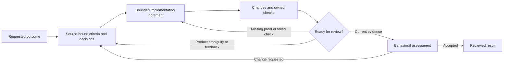

# Iterative Operator UX

Status: accepted design direction from `W57-E1-S1-T3`, recorded on 2026-10-01.
This is a migration blueprint and design hypothesis, not an implemented interaction
contract. The [current target UX](operator-frontend-target-ux.md) and
[frontend contract](operator-frontend.md) still govern the shipped UI.
The [accepted iterative contract](iterative-delivery-contract.md) owns normative authority,
routes, lifecycle and direct breaking cutover; production implementation remains pending.

The [positioning](../product/product-positioning.md) owns the product promise. The
[bounded UI audit and interactive concept](../design/iterative-operator/README.md) make this
direction inspectable. Neither synthetic screenshots nor a successful concept interaction
close native-runtime or genuine-human acceptance tasks.

## Brief and user job

Local developer workbench for an operator accountable for a repository change. Desktop
supports full review and execution; narrow screens support monitoring and bounded
decisions. The operator needs to answer: **What did I ask for? What changed? What was
checked? What is uncertain? What needs my action?**

The design supports `US-02`, `US-03`, `US-05`, `US-06`, `US-10`, `US-11`, `US-12`, and
`US-13`. It retains Markdown artifacts, repair/stop, raw logs, originating project/job
identity, dependency-aware tasks, and scope enforcement. It does not add a separate
workflow engine to the frontend.

## Main journey

1. **Inbox:** choose a Work Item by outcome, blocker, and next action.
2. **Create:** enter Title, Brief, Context, Constraints, Additional information. Runner
   selection comes with launch. Detailed context remains attached to the source request.
3. **Review launch:** show scope, selected route and reason, Runner readiness, and the
   consequence of starting. Proposed criteria and material ambiguity become scoped
   decisions; clear source-backed criteria do not require blanket approval.
4. **Studio:** follow a small implementation increment. See its changes, check results,
   and unresolved questions. Raw logs remain available for the exact active attempt.
5. **Decision or recovery:** inspect the relevant source and evidence, then answer, request
   change, repair, replan, or stop. Saving an answer and resuming execution are separate.
6. **Next iteration:** show what the decision changed and which evidence became stale.
   Preserve the previous run and its relationships rather than overwrite history.
7. **Review result:** compare important criteria with current receipts and behavioral
   assessment. Completed execution alone cannot imply accepted behavior. Complete still
   requires the required fresh terminal quality gates and immutable handoff; a confirmed
   assessment alone does not complete the Work Item.

This diagram describes the user journey, not arbitrary runtime graph support. The finite
routes and their execution semantics belong to the accepted architecture contract.

## Information architecture and screens

Keep global **Inbox / Studio / History**. Work Item remains the navigation object; Task
and Runner retain their current meanings. Do not introduce separate global Specs,
Criteria, Proof, or Decisions areas. Evidence and decisions are contextual to the work.

Within Studio retain **Overview / Tasks / Documents / Runs**. Overview leads with the
requested outcome and current evidence. Selected operations appear in technical detail
under the sole replacement policy. The current alpha's canonical stage strip remains a
description of its captured behavior, not a second profile in the replacement.
No skipped operation is painted as a succeeded stage, and no universal “8/8” progress
measure is reused for the selected routes. Overview exposes the controller action/reason,
shared objective limits, missing proof and stop/cancel control from the common CLI/UI service.

| Surface | Purpose | Primary action |
| --- | --- | --- |
| Inbox | Prioritized work by Needs input, Running, Ready, Complete; visible blocker and next action. | Open the relevant Work Item; create work when empty. |
| Create / launch | Capture protected request; explain scope, route, readiness, and Runner. | Create Work Item, then start when eligible. |
| Studio Overview | Goal/constraint excerpt; criterion coverage; important changes; current proof; next decision. | One core-owned next action. |
| Decision panel | Exact ambiguity/proposal, source, bounded options, affected behavior, and scope. | Save answer or product decision, without implicit resume. |
| Tasks | Dependency-ready work, task criteria, attempts, changed paths, and check receipts. | Run or recover the eligible task; explain disabled dependencies. |
| Evidence inspector | Source → criterion → task → change → receipt → assessment; raw backing records. | Open a source, diff, retained report, or log. |
| Documents | Read / Source / Compare using retained versions and ownership. | Request change or repair for generated output; explicit controlled input edit. |
| Runs / global History | Run lineage, plan revisions, decisions, invalidation, and previous results. | Inspect or return to a specifically identified run. |
| Live output | Exact active task/attempt logs, cancel state, and terminal outcome. | Stop the current job when allowed. |

## Overview hierarchy and visual direction

Use the existing navy project rail, warm workspace, cobalt actions, semantic status colors,
and `operator-tokens.css` scales. No new design system is needed for the first slice.
Reserve green for the particular fact actually confirmed; use text and icon/shape cues
alongside color. A dense workflow workbench benefits from calm spacing and precise labels.

The visible order is:

1. **Context:** project, Work Item title, requested goal, immutable source link, and active
   iteration. Scope and key constraint stay visible without technical expansion.
2. **Current status and next action:** concrete blocker, consequence, and one primary CTA.
   Secondary actions are View evidence and the relevant recovery alternative.
3. **Criterion coverage:** short behavior statements with source and state. Show “2 checked,
   1 decision needed” rather than a composite confidence score or percentage completion.
4. **Changes and proof:** changed paths, behavioral consequence, executed check, freshness,
   and behavioral assessment. Provide one-click access to exact backing records.
5. **Details:** selected operations, Runner configuration, raw logs, and full Markdown.

Do not generate another free-form LLM narrative for this overview. Bounded excerpts,
identities, counts, statuses, and consequences derive from retained data. Unknown data is
labeled unavailable; truncation has a source link. Evidence determines the next action.

## State and recovery matrix

| State | Show | Eligible action / recovery |
| --- | --- | --- |
| New / no run | Goal and source; no execution evidence yet. | Review launch. |
| Loading | Stable context and loading state; no placeholder success. | Wait; context-sensitive writes disabled. |
| Ready | Scope, route reason, dependencies, Runner readiness. | Start selected operation or task. |
| Running | Active increment, exact job context, logs and progress facts. | Stop if supported; no overlapping mutation. |
| Product ambiguity | Source excerpt, question/proposal, affected criterion and consequence. | Save scoped answer/decision; then separately resume. |
| Runtime permission | Requested runtime operation, boundary, risk and origin. | Allow/deny the operation only. |
| Invalid artifact | First decisive validator finding, artifact and remaining repair budget. | Repair or stop; no silent advancement. |
| Runtime failure / task failure | First decisive failure, attempts, retained changes and logs. | Eligible task retry; preserve completed tasks. |
| Failed check | Command/receipt, failing behavior, changed paths, expected behavior. | Repair the affected increment and recheck. |
| Missing proof | Named missing receipt or assessment and affected criteria. | Run required check or perform assessment. |
| Stale proof / conflicting source | Old/current identity, changed constraint, affected receipts/decisions. | Reconcile source or replan; recheck invalidated evidence. |
| Dependency blocked | Named unfinished prerequisite and why this task cannot start. | Open or run the prerequisite. |
| Saved answer | Durable acknowledgement plus remaining blockers and changed plan preview. | Resume only when the core reports eligibility. |
| Execution complete, assessment pending | Current receipts plus unassessed behavior. | Review result; no “accepted” badge. |
| Behavior confirmed, terminal gates pending | Criterion-level evidence and explicit assessment identity; remaining finalization/quality gates. | Complete the required gates; inspect or request change. |
| Complete | Fresh required terminal quality gates, criterion evidence, assessment and immutable handoff. | Inspect result or request a new scoped iteration. |
| Offline / reconnecting | Last known state with timestamp; durable save status and unsent draft. | Reconnect/read back; no automatic mutation replay. |
| Conflict / switched context | Originating project/job and stale response. | Refresh that context; never apply to the newly selected work. |
| Unsupported policy/format | Compatibility reason and retained historical evidence. | Inspect; create a supported new run by explicit action. |

## Authority and evidence rules

Every actionable card binds project, Work Item, run/child run, task/stage, attempt, source
revision, and relevant policy identity. The core owns eligibility and prioritization.
CLI and UI expose the same blocker, next action, and consequence.

Keep three independent dimensions: **authority** (source-backed / proposed / conflicting),
**verification** (not run / passed / failed / stale), and **behavioral assessment**
(unassessed / confirmed / rejected). A passed check cannot grant authority to an invented
requirement; approved product behavior cannot make a failed check pass.

The inspector shows an exact source excerpt/anchor and digest, criterion ID, task IDs,
changed paths/diff reference, registered command, receipt exit/status and execution
identity, and assessment/oracle reference. Runtime summaries and model-authored reports
are labeled claims until owned evidence supports them. Link to the underlying records.

Opening/reading, starting/resuming, answering a question, accepting a product proposal,
allowing a runtime operation, and reviewing a result are separate operations. Avoid a
generic Approve button. Preview the scope and consequence of material product changes.
After saving, require durable read-back before showing success; preserve the draft on
failure. Generated Markdown stays read-only with Request change / Repair actions.

## Responsive and accessible interaction

Desktop can show the evidence inspector beside Overview. Narrow screens use one content
column and a full-width dialog for evidence/decisions; keep the status and next action
near the goal. Do not rely on hover, drag, or horizontal tables for essential facts.
Touch targets are at least 44 px; titles, paths and statuses wrap; code may scroll locally.

Use semantic landmarks/headings and labeled inputs. Focus moves to the opened decision
or dialog, stays within modal content, returns to the trigger on close, and remains stable
after refresh. Escape closes an inspector; keyboard users can reach all primary actions.
Announce save/failure/completion with restrained live regions; do not stream logs into an
assertive announcement. Status meaning must survive color loss and zoom. Respect reduced
motion. Responsive and assistive-technology acceptance requires the production UI checks.

## Acceptance, open questions, and handoff

The first operator task must support locating the original goal and constraint, explaining
a change, finding absent/stale proof, distinguishing a proposal from approved behavior,
and completing a scoped decision without opening every generated document. Recovery must
preserve completed work and reveal what the new answer changed. These are observed tasks,
not assertions derived from the screen design itself.

The [accepted P05 gate](iterative-delivery-decisions.md#p05-first-replacement-operator-observation)
uses five eligible first-time developers/technical leads who did not implement or review
the UI; at least four must complete all predeclared key tasks without hints. Any serious
interface-caused error in any participant blocks acceptance. Sessions remain outstanding;
the concept and this blueprint do not satisfy that gate.

Open questions for the predeclared protocol: the exact cohort/tasks and scoring/attribution,
how much criterion density participants can understand at a glance, and whether the evidence
inspector is sufficient for the most consequential decisions. Counterbalance matched
tasks in the pinned earlier release and replacement candidate, in separate environments,
and measure understanding as well as recovery/errors. A design
review or coached agent walkthrough cannot substitute for genuine operator sessions.

| Handoff | Owning task |
| --- | --- |
| Normative authority, routes, ownership and compatibility | `W57-E1-S1-T1` |
| Baseline, independent expected behavior and acceptance thresholds | `W57-E1-S1-T2` |
| Criterion coverage, proof freshness and authoritative next action | `W59-E1-S1-T1` |
| CLI parity | `W59-E1-S1-T2` |
| Render and verify the production Overview/cards/inspector | `W59-E1-S1-T3` |
| Saved-answer effects and revised plan visibility | `W59-E1-S1-T4` |
| History, identity and context races | `W59-E1-S2-T1/T2` |
| Genuine human observation and resulting cutover decision | `W59-E2-S1-T2/T3` |

Implementation uses existing components/tokens and the nearest Node/browser journeys.
Any new core projection needs deterministic regression evidence. The concept is an
interaction reference; its local state and synthetic transitions must not become a
parallel frontend workflow implementation.
