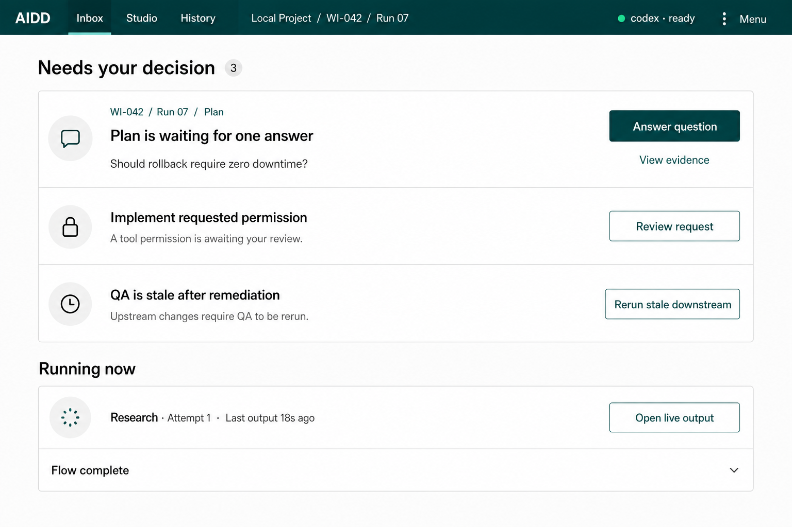
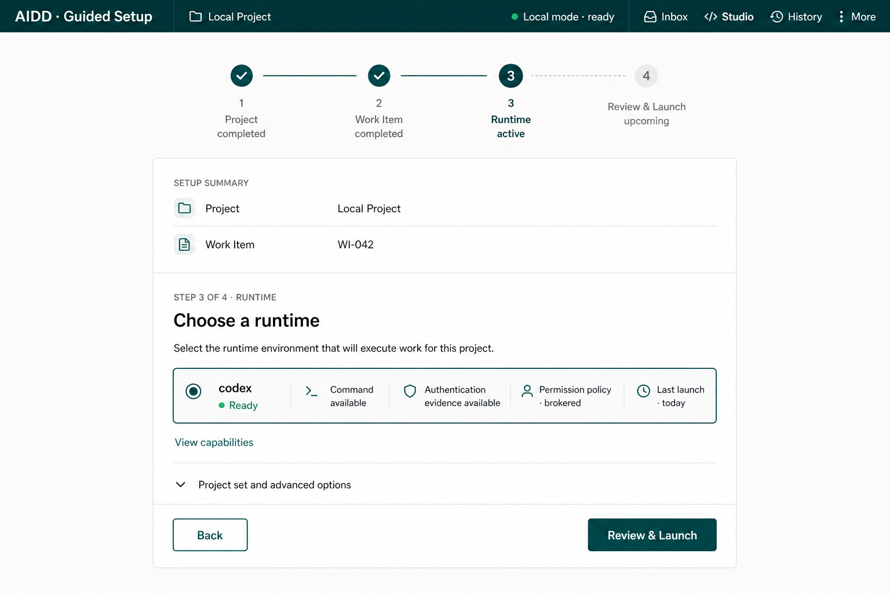
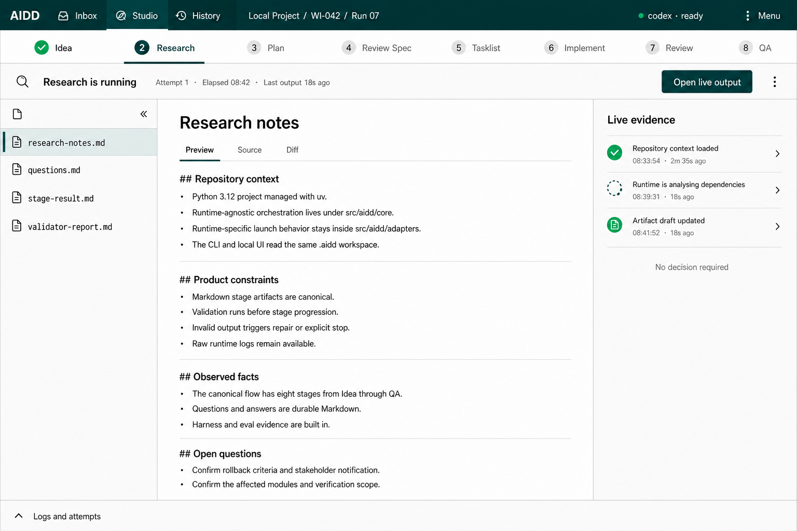
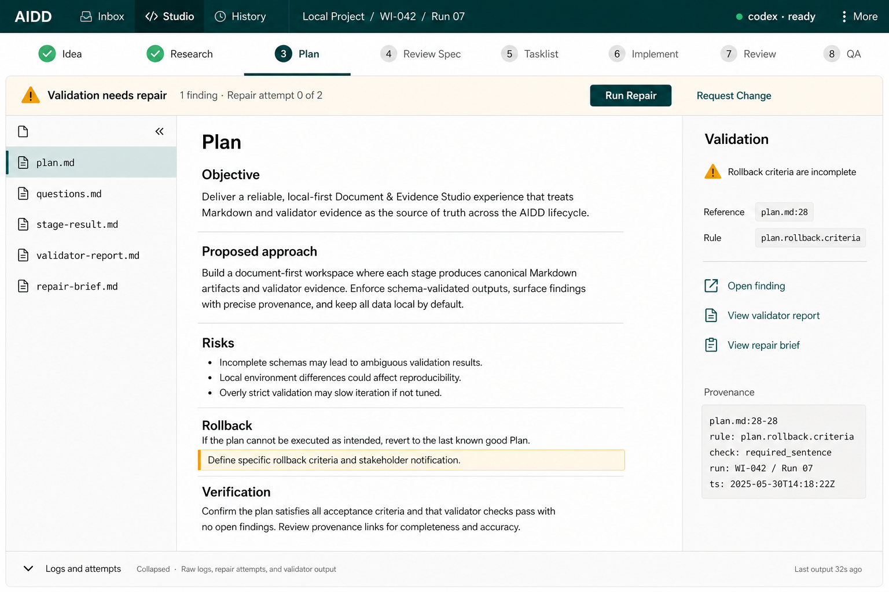
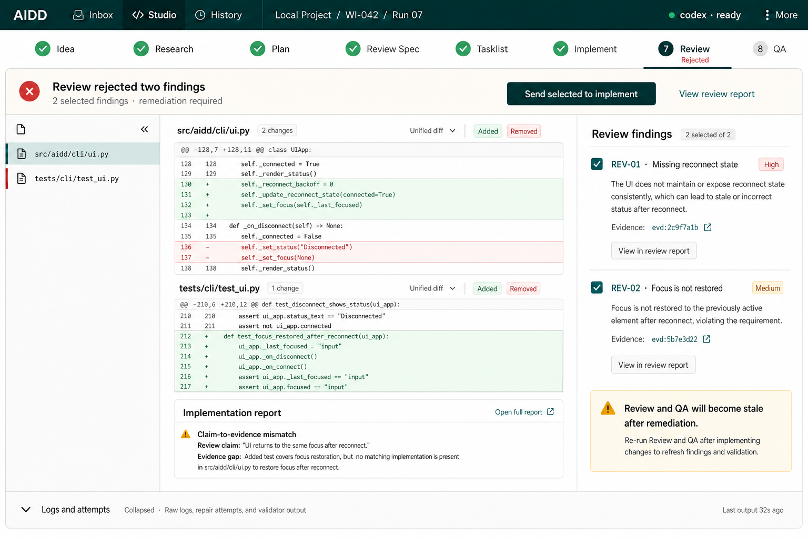
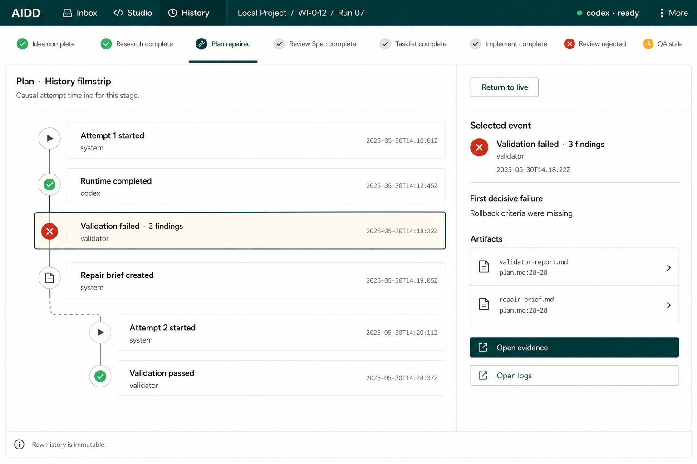
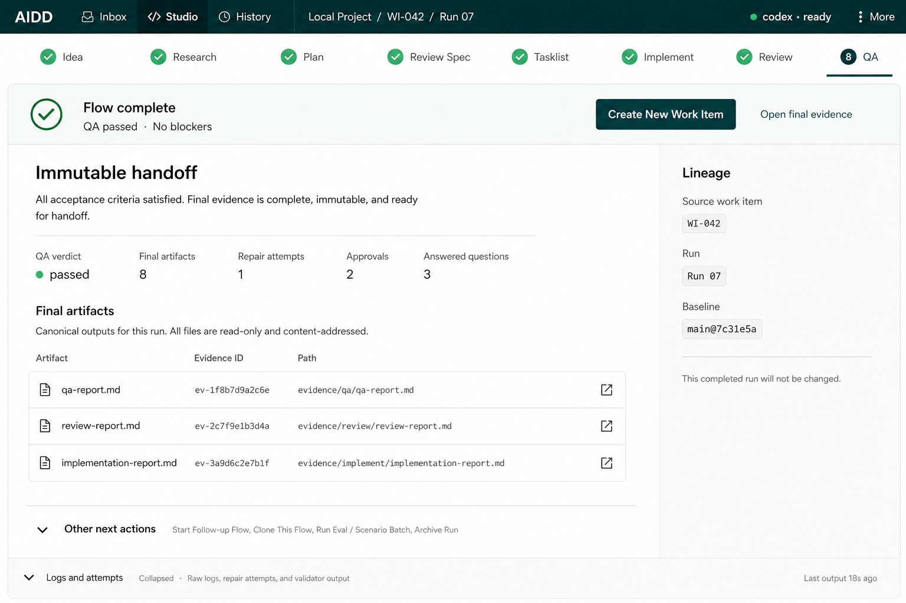
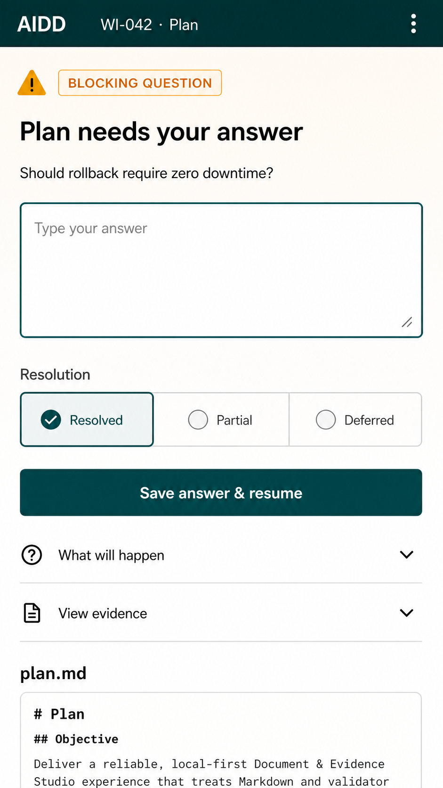

# Operator Frontend Contract

Document status:

- sections 1 through 7 define workflow invariants, write boundaries, compatibility surfaces,
  and the currently implemented packaged frontend baseline;
- sections 8 and 9 define the accepted target information architecture, presentation contract,
  reference screens, and migration acceptance criteria;
- when presentation terminology conflicts, sections 8 and 9 supersede earlier references to
  Mission Control, cockpit, right-rail, bottom-dock, or Work / Recovery / Evidence / History
  navigation; the earlier service, artifact, safety, and workflow semantics remain binding.

## 1. Purpose

The operator frontend is a user-facing surface for the existing governed AIDD
workflow.

It must let an operator:

- start and resume the full `idea -> qa` flow;
- run or inspect an individual stage;
- request a stage-scoped correction or additional analysis without leaving the
  document-first workflow;
- answer blocking questions;
- inspect stage artifacts, validation reports, repair history, and runner logs;
- keep enough provenance visible to compare the frontend action with the CLI action.

The frontend is not a second workflow engine. It must use the same stage graph,
contracts, validators, repair policy, run state, and adapter boundary as the CLI.

## 2. Source of truth

The frontend must not introduce a new canonical artifact format.

Canonical state remains in the repository-local AIDD workspace:

- work-item and stage documents under `.aidd/workitems/<id>/`;
- run and attempt reports under `.aidd/reports/runs/<id>/`;
- eval bundles under `.aidd/reports/evals/<run_id>/`;
- runtime logs, normalized events, validator reports, repair history, and prompt
  provenance already written by the core and harness.

The frontend may render cached views for usability, but cached UI state is not a
workflow authority and must be rebuildable from AIDD artifacts.

## 3. Required operator flows

The first frontend contract covers these flows:

1. **Full workflow run**
   - choose a work item and runtime;
   - start or resume `idea -> qa` through the workflow run application service;
   - show the current stage, terminal state, and next required operator action.

2. **Stage run and resume**
   - choose a stage from the canonical stage list;
   - execute the selected stage through the same single-stage path as `aidd stage run`;
   - show eligibility, missing prerequisites, blocked questions, failed validation,
     repair attempts, and final state;
   - never allow stage progression that the core would reject.

3. **Question answering**
   - show unresolved questions from the standard `questions.md`;
   - write UI answers to the standard `answers.md` as `[resolved]`,
     `[partial]`, or `[deferred]` according to the operator-selected resolution;
   - treat answers as latest-per-question operator input: the UI may edit and replace
     the current answer for the same `QID`, including previously `[resolved]` answers;
   - preserve blocking vs non-blocking question semantics;
   - resume only through the normal core path after answers are present.
   - when blocking questions exist, make the answer form the selected-stage
     Decision Bar priority and use the current run id when resuming the selected stage.

4. **Recovery-first operation**
   - present blocked runs as contextual Recovery inside Studio, reached from Inbox or an exact
     work-item/run/stage deep link; Evidence remains a contextual drill-down;
   - select the exact Recovery context when the next action is blocking questions, failed
     validation, intervention review, approval, or runtime-log inspection;
   - show one dominant recovery summary with affected stage, exact blocker
     reason, affected document/line when available, operator hint, one primary
     action, and one secondary Evidence link;
   - derive repair availability from the backend diagnostics status. The
     frontend must not infer `repair-exhausted` from the mere existence of a
     previous repair attempt.

5. **Runner log viewing**
   - show live runtime stdout/stderr chunks for UI-started jobs when the adapter can stream;
   - show saved `runtime.log` attempt artifacts after execution;
   - show normalized events when available;
   - keep adapter/runtime labels visible so operators can distinguish native
     runtime output from AIDD summaries.

6. **Artifact browsing**
   - render stage input and output Markdown from known artifact-index document keys;
   - show `validator-report.md`, `stage-result.md`, and repair evidence;
   - show run/eval metadata, prompt paths, Git SHA, hashes, runtime id, and adapter id.

7. **Runtime approval handling**
   - show pending runtime operator requests from attempt-level `operator-requests.jsonl`;
   - show auto-approved, denied, or cancelled decisions from `operator-decisions.jsonl`;
   - write approval decisions only through the local job approval API;
   - keep runtime approvals separate from product questions in `questions.md` and
     `answers.md`.

8. **Operator intervention**
   - accept a selected-stage request through UI, CLI, or another operator integration;
   - persist the request as
     `.aidd/workitems/<id>/stages/<stage>/operator-requests/request-0001.md`;
   - run a new attempt in the current run id with `attempt_mode=intervention`;
   - include required inputs, existing same-stage outputs, the latest operator request,
     and available `questions.md` / `answers.md` in the input bundle;
   - validate and publish through the normal post-runtime chain;
   - reject the request when downstream stages have already succeeded in the same run
     unless the operator uses the separate remediation flow described below.

9. **Long-run visibility**
   - expose `/api/jobs/<job_id>` elapsed time, last output time, last output age,
     last output text, and silence warning state for UI-started jobs;
   - expose `/api/run/timeline?run_id=...&stage=...` as a rebuildable timeline over
     stage metadata, attempts, runtime logs, `events.jsonl`, repair history, and
     questions;
   - show real milestones only. The UI must not invent percentage progress.

10. **Implement diff review**
   - expose `/api/repository/diff?stage=implement&run_id=...` as a read-only view over
     the selected project root;
   - separate source file changes from `.aidd/` artifacts;
   - include tracked, deleted, and untracked file changes with bounded unified diff text;
   - show allowed write scope status and whether each changed file was mentioned in
     `implementation-report.md`;
   - keep `implementation-report.md` claims visible beside the real repository diff;
   - when a `project-set.md` context is declared, group changed source files by
     `root_id`, `root_label`, and `root_relative_root`, and flag source changes outside
     declared roots without mixing unrelated repositories into one `.aidd/` workspace.

11. **Structured review and QA**
   - parse `implementation-report.md`, `review-report.md`, and `qa-report.md` through
     tolerant UI-neutral parsers;
   - return warnings instead of throwing when Markdown is malformed or incomplete;
   - keep stage validators as the canonical progression gate. Parsed UI summaries are
     operator guidance, not replacement validators.

12. **Review/QA remediation to implement**
   - let an operator create a durable remediation request from selected review findings
     or QA risks/issues;
   - store the request under
     `.aidd/workitems/<id>/remediations/<run_id>/request-000N.md`;
   - include the latest remediation request as additional input for a new `implement`
     attempt;
   - require an explicit runtime id for remediation launch and downstream rerun;
   - after a successful remediation `implement` attempt, mark downstream `review` and
     `qa` stale through overlay metadata instead of adding a new `StageState`;
   - block stale `qa` from being treated as a fresh terminal handoff in the UI;
   - let the operator explicitly rerun stale downstream stages, either as the existing
     downstream batch or one stale stage at a time through `POST /api/remediation/rerun-stage`.

13. **Prompt/workflow accountability**
   - expose `/api/run/accountability?run_id=...` as a private read-only UI endpoint;
   - expose `/api/run/comparison?baseline_run_id=...&target_run_id=...` as a
     private read-only UI endpoint for comparing two runs from the active work item;
   - show the run id, work item, runtime id, config snapshot summary, config root,
     resource root, Git SHA when available, prompt-pack provenance entries, and canonical
     stage graph;
   - compare runs by prompt hash deltas, stage status deltas, bounded artifact hash
     deltas, and validator outcome deltas without reading outside the project-local
     `.aidd/` workspace;
   - treat missing prompt hashes, missing resource roots, or legacy manifests as warnings,
     not UI crashes;
   - keep prompt paths, content hashes, Git SHA, config root, runtime id, and stage graph
     inputs read-only provenance. The frontend must not edit prompt packs, run manifests,
     or historical artifacts while rendering accountability/comparison views.

14. **Runtime approval audit**
   - expose bounded approval audit rows beside the existing `requests` and `decisions`
     payloads;
   - status values are `pending`, `approved`, `denied`, `cancelled`, `policy-blocked`,
     or `recorded`. Future `expired` handling may be added only when the runtime ledger
     records expiry explicitly;
   - each row should include runtime id, stage, request kind, risk, sensitive command
     summary, cwd/path scope, decision source, decision reason, and ledger paths when
     present;
   - remote approval decisions remain loopback-only by default and require explicit
     `--allow-remote-approvals` opt-in for non-loopback binds.

## 4. Write boundaries

Frontend writes are intentionally narrow:

- answer documents may be written through the same durable question/answer path
  used by the CLI; answer edits replace the latest entry for the same question id and do
  not edit runtime-authored stage outputs;
- operator intervention requests may be written through the durable
  `operator-requests/request-000N.md` path and then executed by the same stage
  runner used by the CLI;
- run or stage execution may be requested only through core workflow commands or
  equivalent application services;
- remediation requests may be written through the durable
  `remediations/<run_id>/request-000N.md` path and then executed by the same stage
  runner used by the CLI for `implement`;
- downstream invalidation metadata may be written as a UI/core overlay under the run
  reports root, but it must not rewrite canonical stage status documents;
- runtime-authored stage outputs, validator reports, repair briefs, runtime logs,
  and eval artifacts must not be edited by the frontend.

The frontend must not silently rewrite generated evidence. Correction workflows use
explicit operator request documents, which become runtime input for a new attempt and
remain auditable in Evidence Refs and Activity.

## 5. Runtime and adapter boundary

Runtime-specific behavior remains inside adapters.

The frontend may display runtime capabilities, provider availability, execution
mode, and log/event support, but it must not encode provider-specific workflow
semantics. Unsupported or degraded runtime behavior should be shown as core or
adapter readiness state, not patched in the UI.

## 6. Minimum implementation surface

The first implementation should expose:

- an implementation-task panel backed by the same task ledger as the CLI, including task status,
  full card fields, dependencies, acceptance criteria, attempt history, abandoned attempts,
  blockers, aggregate finalization state, and Run/Resume/Finalize actions;
- run-scoped task list/detail reads and a mutation endpoint that requires run id and runtime and
  acquires the shared run lease before creating a background job, returning HTTP `409` while
  another workflow, stage, task, or finalization mutation owns the lease;

- work-item selection;
- runtime selection from registered runtimes;
- full-flow start/resume;
- per-stage status;
- blocking question answer form;
- raw log viewer;
- artifact viewer for Markdown documents and run/eval reports.

Anything beyond those flows is follow-up work and should be split into separate
local tasks.

The foundation implementation exposes UI-neutral Python services for run
metadata, stage summaries, logs, artifacts, question status, and answer writes.
The first UI shell must use those services instead of parsing CLI tables or
writing workflow documents directly.

Current W20 implementation status:

- workflow run/start/resume orchestration lives in a reusable core service, with
  the CLI delegating to it;
- `aidd ui --work-item <id> --root <path> --config <path> --host 127.0.0.1 --port 0`
  starts a local-only Python-packaged web UI;
- workflow and selected-stage launch requests require an explicit operator-selected
  runtime and do not fall back to `generic-cli`;
- UI launch requests create process-local jobs; `/api/jobs/<job_id>` exposes
  `running`, `waiting-for-operator`, `completed`, `failed`, or `cancelled` status,
  elapsed time, last-output metadata, silence warning state, and
  `/api/jobs/<job_id>/logs` cursor-based live chunks;
- selected-stage launch uses the CLI-equivalent single-stage execution path, not a
  workflow range shortcut;
- the private local JSON API enforces a small request-body limit and deterministic
  malformed-body errors; non-loopback binds remain allowed but warn because this
  release has no UI authentication;
- private JSON endpoints expose run, dashboard, stage, questions, answer writes,
  persisted logs, artifact summaries, artifact document content, workflow run
  requests, stage run requests, stage intervention requests, and job status/log
  polling over the operator services;
- private JSON endpoints also expose run timeline, read-only repository diff for
  `implement`, parsed implementation evidence, parsed review findings, parsed QA
  verdict, remediation requests, remediation status, remediation launch, and stale
  downstream rerun;
- `POST /api/workflow/run` accepts optional `{run_id}`; when present, the UI asks the
  workflow service to continue that run through normal stage eligibility and the same
  backend config snapshot used by CLI launches;
- UI job state includes `waiting-for-operator`, with
  `GET /api/jobs/<job_id>/operator-requests` and
  `POST /api/jobs/<job_id>/operator-requests/<request_id>/decision` for local runtime
  approvals; these runtime approvals remain attempt artifacts and are separate from
  product/operator questions in `questions.md` and `answers.md`;
- approval decisions are loopback-only by default; non-loopback binds must opt in with
  `--allow-remote-approvals`;
- `POST /api/stage/interact` accepts `{stage, runtime, run_id, request,
  target_documents, log_follow}`, validates the request shape, and starts a
  process-local intervention job; the durable request artifact and attempt semantics
  are handled by core/CLI services, not by JavaScript state;
- `GET /api/dashboard?stage=<stage>&run_id=<run_id?>` returns an
  `OperatorDashboardView` containing project/work-item/run summary, canonical
  stage rail, selected-stage cockpit data, next action, blockers, evidence refs,
  recent activity, and recent artifacts derived from existing `.aidd/` state;
- `GET /api/project-home` returns the integrated Project Home read model for the selected
  local project root, `.aidd` root, discovered work items, latest run summaries, stage
  progress, blockers, terminal state, and project-set roots;
- `GET /api/work-item/resume?work_item=<id>` returns read-only resume context for a
  selected work item before the UI switches the active command-center context;
- dashboard `next_action` is run-global, not only selected-stage-local: unresolved
  blocking questions are surfaced before runnable-stage suggestions, failed
  validation points to validation inspection, and only existing artifact files are
  shown in Recent Artifacts;
- the static UI is organized as an integrated workbench matching
  `13-integrated-operator-workbench.png`: Project Home and Work Item Board sit before the
  active-run workbench; a primary run-global Next Action strip sits above the selected
  stage work area; the central Document Workbench groups known artifacts by category;
  the Artifacts tab opens the Stage Document Workbench first and keeps the evidence
  graph/table behind a secondary drill-down; the right rail shows Recovery Assistant,
  blockers, evidence, runtime root, and safety; the bottom dock keeps Activity / Events
  and Recent Artifacts available;
- artifact read models classify documents and logs as canonical stage documents, runtime
  inputs, validation evidence, runtime evidence, project evidence, or lineage evidence,
  while preserving the existing artifact-index and workspace-relative path safety model;
- dashboard `first_failure` and `recovery_actions` summarize the first decisive runtime,
  validation, question, repair, or stopped-stage signal without replacing validators,
  repair policy, or stage progression rules;
- validation failures expose a structured UI read model derived from
  `validator-report.md` finding bullets, including code, severity, affected document,
  optional line number, message, category, duplicate occurrence count, and operator hint;
  the primary finding must be visible in the run-global Next Action / Recovery surface
  without requiring raw report inspection;
- validation recovery must make the next operator action explicit: when repair is
  available, `Run Repair` is the primary action; when repair budget is exhausted or the
  stage explicitly stopped, `Request Change` is the primary action and raw logs/evidence
  remain secondary drill-downs;
- Recent Activity includes run/stage metadata and `events.jsonl` entries across
  all attempted stages plus `operator.request.created` entries for durable
  intervention requests; the static UI overlays process-local live job chunks into
  the Activity table while a UI-started run is active;
- Evidence Refs and Recent Artifacts include the latest operator request for the
  selected stage when present;
- the selected-stage cockpit includes a `Request change` tab with an escaped
  textarea and current-stage target document selector; submitting switches to the
  Logs tab and follows the intervention job through the same polling path as stage
  runs;
- long workspace-relative paths are retained in payloads and element titles, but
  rendered in compact form so evidence lanes stay scannable in the right sidebar
  and bottom dock;
- the command center includes an Active Run panel with job id, stage, selected runner,
  elapsed time, last output age, timeout summary, runner command, cancel action, and
  logs shortcut;
- the stage cockpit includes Timeline, Implement Review, Review Findings, and QA Verdict
  tabs. Implement Review renders source diff separately from `.aidd/` artifacts and
  flags changed-but-not-mentioned, mentioned-but-unchanged, outside-scope, and truncated
  diff evidence;
- when a project-set declaration is present, Implement Review groups source diff rows by
  declared root labels and flags `outside-project-set` source changes without changing
  single-project clients that ignore the optional grouping fields;
- the overview cockpit includes Prompt / Workflow Accountability cards backed by
  `/api/run/accountability`, showing prompt provenance, config snapshot keys, runtime id,
  stage graph, Git SHA, and legacy-provenance warnings;
- the Run History cockpit includes a read-only run comparison panel backed by
  `/api/run/comparison`, defaulting baseline selection from lineage/source-run context
  when available and allowing manual baseline run id entry for bounded prompt, stage,
  artifact, and validator drift review;
- approval views render server-provided `audit_history` rows in addition to existing
  request and decision payloads, preserving the current runtime approval write semantics;
- review and QA tabs can launch remediation back to `implement` with selected source ids,
  operator note, selected runtime, and current run id; downstream stages are marked stale
  only after the remediation `implement` attempt succeeds;
- stale downstream stages keep their existing canonical status but show a stale badge and
  reason in the UI. The run-global next action becomes explicit stale downstream rerun;
  the per-stage remediation rerun API executes exactly one stale stage and clears stale
  metadata only after that stage succeeds;
- workflow and stage launches are primarily routed through the right-side Next
  Action button so the top bar stays status/control-plane focused;
- `POST /api/open-folder` is a loopback-only convenience action for allowlisted
  workspace, stage, and artifact folders inside `.aidd/`; it does not create or
  mutate workflow artifacts;
- `POST /api/server/stop` stops only the local UI server. It explicitly reports
  that runtime job cancellation is not provided by this redesign because current
  UI jobs are thread/subprocess executions without a core cancel token;
- the UI shell serves static HTML, CSS, and JavaScript from the Python package,
  without a Node or Vite dependency;
- dynamic question text, stage metadata, artifact labels and paths, runtime-derived
  values, artifact document content, and logs are rendered through escaped UI text paths;
- local smoke evidence covers page load, dashboard payload shape, blocking answer
  persistence to `answers.md`, answer-and-resume with the current run id, persisted
  log reads, structured live job log chunks, artifact document rendering, local-only
  open-folder/server-stop actions, stage intervention request dispatch, and
  workflow-run delegation through the internal service seam.

## 7. Onboarding-first startup

The recommended first-run operator path starts in the local UI, but existing CLI
subcommands remain compatible scripted surfaces. Bare `aidd` and `aidd --help` keep their
current help behavior in this release. `aidd ui` can start without `--work-item` and then
serves setup mode; `aidd ui --work-item <id> --root <path>` bypasses setup mode and opens
the existing command center for initialized work items.

Setup mode is a launcher over the same repository-local state model, not a separate
workflow authority. It must let the operator:

- enter or confirm a local project root;
- validate that the selected path is a directory and does not escape the local filesystem
  root through parent traversal or symlink resolution;
- resolve the project-local `.aidd/` workspace;
- discover existing work items in that workspace;
- create a new work item through the same workspace bootstrap and request-seeding behavior
  as `aidd init --work-item ... --request ... --root .aidd`;
- resume an existing work item without creating duplicate workspace state;
- inspect runtime readiness before any workflow run exists;
- explicitly select a runtime before workflow, stage, intervention, follow-up, or clone
  execution starts.

Runtime readiness remains observational. The UI may preselect a project-local runtime
preference as a convenience, but every launch request must still include the operator-selected
runtime id. There is no hidden `generic-cli` fallback.

One UI process may maintain a noncanonical recent-project list, but each active workflow,
job, answer write, log read, artifact read, and `.aidd/` workspace mutation is scoped to one
selected project root. Multiple roots inside a monorepo or related local workspace use the
existing declared `project_set` model. Unrelated repositories must not be combined into one
governed `.aidd/` workspace unless a future architecture decision introduces a multi-context
job registry.

## 8. Accepted next-generation UX direction

The accepted direction is **Document & Evidence Studio**: a document-centered operator
experience with four coordinated modes and one shared workflow authority. It replaces the
previous Mission Control visual hierarchy as the target for future frontend work. The old
reference assets remain historical implementation context; they are not the target design.

The concept uses one mental model:

- **Inbox** answers: "What requires my decision now?"
- **Studio** answers: "Which canonical document, decision, or evidence am I reviewing?"
- **History** uses an execution Filmstrip to answer: "How did this run reach this state?"
- **Guided Delivery** answers: "What should I do next, why, and what will it change?"

Guided Delivery is a presentation mode over the same core services, not a second workflow.
Inbox and History are rebuildable read models over `.aidd/`, not sources of truth. Studio
does not turn generated documents into an unaudited editor: answers, intervention requests,
remediation requests, approvals, and launch requests continue to use the write boundaries in
section 4.

### 8.1 Users and primary jobs

| User | Primary jobs |
| --- | --- |
| First-time operator | Select a project, create or resume a work item, choose a runtime, launch safely, and understand why progression stopped. |
| Experienced operator | Clear blocking decisions quickly, inspect the exact stage and attempt, repair or remediate, and continue without losing context. |
| Maintainer or evaluator | Compare runs, prompt and validator evidence, attempts, and the first decisive failure. |
| Platform engineer or adapter author | Inspect runtime readiness, capabilities, approvals, raw logs, and adapter evidence without changing core semantics. |

The interface keeps canonical nouns such as `Project`, `Work Item`, `Run`, `Stage`,
`Attempt`, `Runtime`, `Artifact`, and `Evidence`. Guided Delivery explains those terms in
context instead of inventing a separate simplified vocabulary.

### 8.2 Information architecture

The visible object hierarchy is:

```text
Project root -> Work Item -> Run -> Stage -> Attempt / Task attempt -> Artifact / Evidence
```

The stable global navigation model contains three destinations and one presentation preference:

1. **Inbox** — default entry for an existing project-local workspace.
2. **Studio** — the selected work item, run, stage, document, and current decision.
3. **History** — expanded Filmstrip, run comparison, and lineage.
4. **Guided Delivery preference** — a persistent presentation toggle and contextual guide, not
   a destination or separate workflow route.

Maintenance actions such as **Refresh**, **Open `.aidd`**, and **Stop server** live in a
labelled overflow menu. Questions, approvals, Request Change, evidence details, logs, and
comparison are contextual surfaces; they are not permanent global destinations.

Entry behavior is deterministic:

- an invalid project root or missing work item opens Guided Setup;
- an initialized workspace opens Inbox;
- a deep link restores the exact work item, run, stage, mode, attempt, and artifact when
  those objects still exist;
- an active job has one server-authoritative live state shared by Inbox and Studio;
- a completed run appears as a next-decision item while the source run remains immutable.

Inbox is scoped to the currently selected project-local `.aidd/`. A future cross-project
Inbox requires a separate safe context registry and is outside this contract.

### 8.3 Inbox mode

Inbox is a bounded decision queue, not an activity feed or a dashboard of every available
metric. Its ordered sections are:

1. **Needs your decision** — blocking question, runtime approval, validation or runtime
   failure, repair exhaustion, or remediation decision.
2. **Running now** — active jobs, last output age, silence warning, and reconnect state.
3. **Ready to continue** — an eligible stage or task, or stale downstream rerun.
4. **Flow complete** — terminal QA handoff and the recommended next-flow decision.

Each item shows the work-item/run/stage breadcrumb, factual state, timestamp, one primary
action, one **View evidence** action, and runtime or attempt identity when relevant. Blocking
items cannot be dismissed. Any noncanonical snooze behavior must be local-only and must not
hide a blocker.

The frontend must not derive workflow policy from presentation state. Priority, eligibility,
the first decisive failure, and the primary action come from core-owned read models. Inbox
may aggregate those facts but must not create an alternate progression engine.

### 8.4 Studio mode

Studio is the default working surface and the visual foundation for the entire concept.
Desktop order is:

1. compact project/work-item/run/runtime context bar;
2. a **Decision Bar** with one primary action and a short factual reason;
3. canonical eight-stage navigation;
4. a central **Document Canvas** with `Preview`, `Source`, and `Diff` views;
5. a contextual **Evidence Inspector**, hidden when it has no decision value;
6. a collapsed Filmstrip that expands into attempt and event diagnostics.

The stage navigation communicates canonical progression. The Filmstrip communicates temporal
history. They must not duplicate the same status list.

The Document Canvas prioritizes the canonical Markdown artifact. Generated stage outputs,
validator reports, repair briefs, implementation reports, and runtime logs are read-only.
Corrections use **Answer question**, **Request Change**, repair, remediation, or the relevant
runtime approval path. Opening the inspector must not obscure the document that gives the
evidence its meaning.

For `implement`, Studio adds the dependency-ready task ledger, task-attempt evidence, real
repository diff, aggregate publication state, and finalization recovery. Successful tasks
remain preserved when a later task, validation, or finalization attempt fails.

### 8.5 History and Filmstrip mode

A Filmstrip frame represents a real stage attempt, task attempt, or durable aggregate
milestone. Events are markers inside a frame; event-per-frame rendering is too noisy.

Each available frame shows:

- stage or task id and attempt number;
- attempt mode: normal, repair, intervention, remediation, or finalization;
- runtime, status, start time, and duration;
- validator outcome;
- question, approval, repair, runtime failure, and publication markers;
- the first decisive failure or primary artifact when available.

Selecting a frame opens only evidence that actually exists. **Compare** shows an artifact or
validator delta only when both sides were durably retained. **Open logs** opens the exact
attempt and correlated event range. The interface must say that a historical snapshot is
unavailable rather than reconstructing one from current files.

A live frame shows elapsed time, last output age, and silence or reconnect status without a
fabricated percentage. Looking at an older frame pauses auto-follow and exposes **Return to
live**. On mobile, Filmstrip becomes a vertical chronological drill-down instead of a wide
horizontal scroll surface.

History preserves parent/source/current/child lineage, archive state, and read-only access to
artifacts and logs. Comparison remains within the active work item or explicit source lineage;
unrelated projects are not silently compared.

### 8.6 Guided Delivery mode

Guided Delivery is enabled by default for clean setup and can be toggled without losing the
selected context. Its setup sequence has at most four decision steps:

1. **Project** — validate the root and resolved `.aidd/`; keep `project_set` under
   **Advanced**.
2. **Work Item** — show peer **Create** and **Resume** paths with request/context preview.
3. **Runtime** — show binary, command, authentication evidence, capabilities, permission
   policy, and last launch evidence separately.
4. **Review & Launch** — summarize work item, runtime, action, scope, and evidence
   destination before launch.

During a run, the guide becomes one contextual explanation: what happened, why the stage
stopped or is ready, what the operator must decide, which durable artifact will be written,
one primary action, and **View evidence**. At terminal QA it becomes a Start Next Flow guide.

Guided Delivery and Studio must call the same service path for the same action and must
produce the same durable result. Guided preference may be stored as noncanonical browser
state; it must never alter runtime selection, eligibility, validation, or artifacts.

### 8.7 Main operator journey

1. Enter through Guided Setup or Inbox.
2. Select the highest-priority decision or a ready work item.
3. Open Studio at the exact run, stage, document, and evidence context.
4. Act on one core-provided next action.
5. After launch, observe real milestones in the same Studio; a live Filmstrip frame appears.
6. Resolve a question, approval, validation failure, runtime failure, or repair stop without
   losing the selected document and attempt.
7. Run `implement` task by dependency-ready task and finalize the aggregate before review.
8. Send rejected review findings or not-ready QA risks to `implement` through a durable
   remediation request.
9. Rerun stale downstream `review` and `qa`; stale QA is never terminal.
10. Enter Flow Complete only after fresh terminal QA, then create an independent next outcome.

The core-provided primary action may be **Run workflow**, **Run selected stage**,
**Run task**, **Resume task**, **Finalize implement**, **Answer question**,
**Review request**, **Run Repair**, **Request Change**, **Send selected to implement**,
**Rerun stale downstream**, or **Start Next Flow**. Labels must describe the actual service
call and must not collapse distinct actions into generic **Continue** when consequences differ.

### 8.8 Screen inventory

| Surface | Purpose | Primary action |
| --- | --- | --- |
| Guided Setup | Project -> Work Item -> Runtime -> Review & Launch | Current setup step or **Launch workflow** |
| Inbox | Show decisions and active work for the selected project | Action of the highest-priority item |
| Work Item Studio, no run | Review intake, context, and launch readiness | **Review & Launch** |
| Active Stage Studio | Keep document, live state, and current decision together | Core-provided next action |
| Recovery Studio | Resolve question, approval, failure, repair, or intervention | One eligible recovery action |
| Implement Workspace | Run tasks, inspect attempts and diff, then finalize | **Run/Resume task** or **Finalize implement** |
| Review / QA Decision | Review findings, verdict, risks, and evidence ids | Eligible progression or **Send selected to implement** |
| Filmstrip Diagnostics | Inspect attempts, milestones, logs, and retained comparisons | **Open selected evidence** |
| Flow Complete | Review immutable handoff and select disposition | Recommended next-flow action |
| History / Lineage | Open, compare, or archive related runs | **Open run** or **Compare** |

The accepted completed-flow outcomes remain:

- **Create New Work Item** — unrelated scope with no inherited source context;
- **Start Follow-up Flow** — a new work item from selected QA, review, validation, log, or
  artifact evidence;
- **Clone This Flow** — a new run identity from the same configuration and baseline with an
  editable launch preview;
- **Run Eval / Scenario Batch** — comparison evidence outside the completed source run;
- **Archive Run** — local operator intent without deleting evidence.

#### 8.8.1 Action-to-service semantics

Visible labels name their actual consequence. Guided Delivery and Studio dispatch the same
endpoint/application service for the same action; presentation mode cannot select a different
mutation path.

| Visible action | Endpoint / application service | Durable outcome | Eligibility and conflict behavior |
| --- | --- | --- | --- |
| **Validate project** | `POST /api/onboarding/project` / canonical project validation | Validation result only; no workspace write | Invalid, blank, escaped, or inaccessible roots fail before mutation. |
| **Create Work Item** | `POST /api/onboarding/work-item` / workspace bootstrap | New canonical work-item context | Requires a valid project and safe unused identifier; conflicts read back existing state instead of overwriting. |
| **Resume Work Item** | `POST /api/onboarding/work-item` / existing-work-item selection | No new work-item evidence; selected durable context changes | Requires an existing valid work item; missing or stale identity returns a factual error. |
| **Launch workflow** | `POST /api/workflow/run` / workflow execution service | Run manifest, stage attempts, and governed stage outputs | Requires explicit eligible runtime and bounds; duplicate launch is suppressed and conflicts reconcile to server state. |
| **Run selected stage** | `POST /api/stage/run` / stage execution service | One governed stage attempt in the selected run | Requires stage eligibility, explicit runtime, and matching run identity; progression guards remain authoritative. |
| **Start Follow-up Flow** | `POST /api/next-flow/follow-up-draft/create`, then preflight and `POST /api/next-flow/launch` | Independent child work item/run with source lineage | Requires terminal source evidence and selected sources; draft is noncanonical until launch, and launch conflicts preserve the durable winner. |
| **Clone This Flow** | `POST /api/next-flow/clone-draft/create`, then preflight and `POST /api/next-flow/launch` | Independent run identity with declared baseline/source lineage | Requires a valid immutable source and launchable preflight; never mutates the source run. |
| **Run Eval / Scenario Batch** | External/manual handoff to the supported harness/eval command surface | Eval evidence outside the completed run, if the operator executes it | No local operator-UI execution endpoint exists; render a handoff, never a successful local mutation. |
| **Archive Run** | `POST /api/next-flow/archive` / append-only archive-overlay service | New immutable archive decision overlay | Requires terminal QA; retries follow durable overlay semantics and never edit the run manifest. |

Draft, preflight, and launch are distinct actions because their consequences differ. The UI
must not label them all **Continue**, and it must not show a draft or preflight response as a
created work item or launched run.

#### 8.8.2 Truthful state vocabulary

Runtime presentation reports independent facts rather than one inferred `ready` badge:

| Fact | Canonical presentation |
| --- | --- |
| Provider detection | `detected`, `not detected`, or `unknown`, based only on the probe result. |
| Execution command | `configured and executable`, `configured but unavailable`, `not configured`, or `unknown`. |
| Authentication evidence | `confirmed`, `not confirmed`, `failed`, or `unknown`, with the evidence source and observation time. Binary or config presence is not authentication evidence. |
| Adapter capability | Named supported capabilities and transport from the adapter capability report; provider help text alone does not create an AIDD capability. |

The UI may say an action is **eligible** only when the core read model confirms every required
fact. It must not derive `ready` from binary detection or configuration alone.

Safety-related facts are also separate and literal:

- permission policy uses its configured value, such as `full_access`, `brokered`, or
  `deny_unapproved`;
- allowed-write scope shows the canonical path prefixes, `unrestricted` when the document is
  absent by contract, or a malformed-state error;
- approval breadth shows the actual request kind/capability and bounded preset or explicitly
  says that operator review is required.

The umbrella label `safe` is not a substitute for these facts.

Connectivity has exactly four observable states: `online` after a successful current transport
exchange, `reconnecting` while bounded retry is active, `offline` after observed transport
failure, and `unknown` before evidence exists. Runtime success/failure is not inferred from
browser connectivity.

Every client mutation uses `idle`, `pending`, `conflict`, `succeeded`, `failed`, or `cancelled`.
Optimistic state is never authoritative: after a conflict, retry, reconnect, or cancellation
race, the durable server winner and its evidence determine the displayed result.

Only one is promoted. Clean completed runs without blockers recommend **Create New Work
Item**. Failed, blocked, or warning handoffs recommend **Start Follow-up Flow**. The remaining
outcomes live under **Other next actions**, not an equal-weight card grid.

Here, failed, blocked, or warning handoff means a fresh terminal QA verdict. Missing QA,
stale QA, and runs that have not reached terminal QA do not enter Flow Complete and receive no
terminal recommendation.

Follow-up and cloned flows show source work item, source run, baseline, inherited artifacts,
and audit preview before launch. They always receive new identities and never mutate the
completed source run.

### 8.9 State and recovery matrix

| State | Surface | Primary action | Required behavior |
| --- | --- | --- | --- |
| Invalid or missing project root | Guided Setup | **Validate project** | Field-level error and no workspace mutation. |
| Valid project, no work items | Inbox empty state | **Create Work Item** | Hide empty Evidence and History regions. |
| Work item, no run | Studio | **Review & Launch** | Explicit runtime required. |
| Running, output fresh | Active Studio | **Open live output** | Cancel remains secondary and dangerous. |
| Polling failure or reconnecting | Active Studio | Automatic retry or **Reconnect** | Runtime may still be running; preserve log cursor. |
| Waiting runtime approval | Recovery Studio | **Review request** | Keep separate from product questions; show scope, breadth, reason, and audit state. |
| Blocking question | Recovery Studio | **Answer question** | Preserve resolved/partial/deferred semantics; only resolved unblocks. |
| Validation failed, repair available | Recovery Studio | **Run Repair** | Show exact finding, document, line, hint, and attempt budget. |
| Repair exhausted or explicit stop | Recovery Studio | **Request Change** | Never infer repair availability from stale artifacts. |
| Runtime or provider failure | Recovery Studio | **Review failure** then eligible retry | Do not consume validation repair budget. |
| Intervention allowed | Studio | **Submit & run** | Persist Markdown request and revalidate normally. |
| Intervention blocked by succeeded downstream | Recovery Studio | **Open remediation options** | Never bypass downstream invalidation policy. |
| Implement task blocked or failed | Implement Workspace | **Resume task** or answer | Keep dependencies and successful tasks intact. |
| Review rejected or QA not ready | Review / QA Decision | **Send selected to implement** | Persist selected finding or risk ids. |
| Successful remediation | Recovery Studio | **Rerun stale downstream** | Stale QA never opens Flow Complete. |
| Fresh terminal QA | Flow Complete | Recommended next-flow decision | Keep source run immutable. |
| Archived or historical run | History | **Open evidence** | Read-only; archive is not deletion. |
| Missing or malformed legacy evidence | Studio | **View available source** | Name the missing artifact, degrade safely, and never invent data. |
| Loading | Current surface | None | Stable skeleton and disabled mutation controls. |
| Mutation pending or conflict | Current surface | Pending or **Read latest state** | Suppress duplicates and show the durable server winner. |

### 8.10 Interaction contract

- Every state and viewport has exactly one visually primary action.
- Disabled controls explain the missing runtime, prerequisite, dependency, or stale state.
- Workflow, stage, task, intervention, remediation, follow-up, and clone launches require an
  explicit runtime id wherever the existing service contract requires one.
- Every mutation enters an immediate pending state and uses keyed duplicate suppression.
- A conflict triggers server readback, never optimistic overwrite.
- Cancel job, deny, session-wide approval, archive, and next-flow launch show consequences;
  session-wide approval requires a separate confirmation.
- Cancellation progresses through **Cancel requested**, **Cancelling**, and **Cancelled**;
  the UI does not claim immediate process termination.
- Question, intervention, follow-up, and clone drafts survive supported navigation and reload.
  Successful submit clears only the owning draft; a browser draft is never canonical evidence.
- Browser URL state includes work item, run, stage, mode, attempt/detail, and artifact.
- Back, Forward, and reload restore the selected context or fall back explicitly when it is
  unavailable.
- Live polling uses cursor-preserving bounded backoff. Raw logs are not a noisy `aria-live`
  region; a separate polite status reports chunk count, output age, reconnect, and terminal
  transitions.

Document and evidence behavior is fixed:

- the primary document remains visible when the inspector opens;
- Preview preserves Markdown heading, list, table, link, and code semantics;
- Source is selectable, copyable plain text;
- Diff includes textual added/removed/changed meaning, not color alone;
- exact paths are copyable but visually secondary;
- a missing artifact is named instead of producing an empty surface;
- raw logs are an explicit drill-down with native/system/normalized filters and visible
  truncation state;
- no surface may read arbitrary paths or rewrite generated evidence inline.

### 8.11 Responsive and accessibility contract

The layout has one primary vertical scroll owner. Desktop may use three workbench columns;
tablet moves the Evidence Inspector into a drawer; mobile uses a single decision-first column.

| Viewport | Layout behavior |
| --- | --- |
| `>= 1280px` | Compact context bar; 208-224px stage/artifact rail; flexible Document Canvas; 300-336px inspector when valuable; collapsed bottom Filmstrip. |
| `768-1279px` | Horizontal stage navigation; full-width document; inspector and Filmstrip in labelled drawers. |
| `< 768px` | Context bar no taller than 80px; current decision in the first viewport; document follows; evidence and vertical Filmstrip open as bottom sheets or dedicated drill-downs. |

Further requirements:

- **Skip to current decision** is the first focusable control.
- Focus order is context, primary decision, document, supporting evidence, maintenance.
- Dialogs and drawers trap focus while open and restore it to their trigger.
- Stage navigation is an ordered semantic control with visible names in accessible names;
  status is separate text.
- Filmstrip is an ordered list or navigation with `aria-current`; Arrow, Home, and End are
  optional accelerators and never replace Tab.
- Status is never communicated only through color, shape, or motion.
- Touch targets are at least 44x44px.
- The primary decision is visible without initial scroll at `320x568` and `390x844`.
- Text contrast is at least 4.5:1; control boundaries and focus indicators are at least 3:1.
- `prefers-reduced-motion` removes pulses and nonessential transitions while keeping live
  state text.
- Dense diff, graph, and lineage views are deliberate mobile drill-downs. Monitoring,
  questions, approvals, recovery, and the next decision are first-viewport tasks.
- Declared viewports have no page-level horizontal overflow, clipped primary labels, or
  nested scroll traps.

### 8.12 Visual system

The visual language is editorial, calm, and evidence-first. It uses the existing light
foundation and deep-teal product identity, but removes the equal-weight card wall. White space,
typographic hierarchy, dividers, and a single decision color carry structure. Status colors are
signals, not section backgrounds.

Semantic token direction:

| Token | Reference value | Use |
| --- | --- | --- |
| `--bg` | `#f6f7f5` | Application canvas. |
| `--surface` | `#ffffff` | Document, drawer, and primary working surface. |
| `--surface-soft` | `#f0f3f0` | Grouped navigation and secondary evidence. |
| `--surface-inverse` | `#073b3c` | Compact brand/context chrome only. |
| `--text` | `#14201b` | Primary text. |
| `--muted` | `#5e6a63` | Secondary text that still meets body contrast. |
| `--line` | `#d7ddd8` | Dividers and low-emphasis boundaries. |
| `--action-primary` | `#0b696b` | The single primary action and selected navigation. |
| `--action-primary-hover` | `#084f51` | Primary hover/active state. |
| `--status-success` | `#16784a` | Success signal with text/icon reinforcement. |
| `--status-warning` | `#8b5d08` | Waiting, stale, or repair signal. |
| `--status-danger` | `#a52a31` | Failed, rejected, and destructive signal. |
| `--status-info` | `#1f5e98` | Running and informational signal. |
| `--focus` | `#245fb3` | High-contrast focus ring independent of status. |

Implementation should introduce these semantic aliases rather than spreading raw hex values.
Compatibility mappings may preserve existing `--teal`, `--green`, `--amber`, `--red`, and
`--blue` variables during migration.

Typography uses the existing Inter/system stack for UI and the existing monospace stack for
paths, source, logs, hashes, and ids. Reference roles are 32/40 for a guided page title, 24/32
for a Studio document title, 18/26 for section headings, 14/21 for body text, 12/16 for labels,
and 13/20 monospace for source. Body UI text must not fall below 12px.

The spacing scale is 4, 8, 12, 16, 24, and 32px. Guided surfaces use relaxed 16-24px gaps;
repeated operational lists use compact 8-12px gaps. Controls use a 6px radius, working
surfaces 8px, dialogs 10px, and pills only for status or compact filters. Borders establish
most layers; elevation is reserved for overlays. Motion uses 120ms control feedback, 180ms
drawer transitions, and 240ms context changes, all with reduced-motion alternatives.

### 8.13 Component contract

| Component | Required anatomy and variants |
| --- | --- |
| Decision Bar | Reason, factual status, one primary action, optional evidence link; ready, running, waiting, blocked, failed, complete, and reconnecting variants. |
| Inbox Item | Breadcrumb, title, explanation, timestamp, runtime/attempt metadata, primary action, evidence action; decision, running, ready, and complete variants. |
| Document Canvas | Artifact title/path, Preview/Source/Diff switch, content, missing/truncated notice, copy/open actions; read-only in every variant. |
| Evidence Inspector | Finding or evidence title, provenance, exact source reference, related artifacts, contextual action; hidden when empty. |
| Stage Navigation | Eight canonical stages, active selection, status text, stale marker, keyboard navigation; compact desktop and horizontal tablet variants. |
| Filmstrip Frame | Stage/task, attempt mode, runtime, timestamps, outcome, markers, artifact/log links; live, selected, failed, repaired, and unavailable-snapshot states. |
| Guided Step | Step name, why it matters, inputs, validation feedback, primary action, back action, advanced disclosure. |
| Recovery Summary | First decisive failure, scope, evidence, repair availability, consequences, one recovery action. |
| Runtime Readiness | Binary, command, authentication evidence, capabilities, permission policy, last launch; ready, incomplete, unsupported, and stale-evidence variants. |
| Status Marker | Icon, text, and optional timestamp; never color-only. |
| Empty/Error/Reconnecting Surface | Named state, truthful consequence, available evidence, one safe action; stable dimensions to avoid layout shift. |

Every component must define hover, active, focus-visible, disabled, pending, selected, invalid,
empty, and loading behavior where the state is applicable. Compact and relaxed density variants
share anatomy and semantics; they do not create separate action paths.

### 8.14 Visual references

The accepted reference set is stored in
`docs/architecture/assets/operator-ui-document-evidence-studio/`:

1. `01-inbox-desktop.png` — the decision-first project entry.
2. `02-guided-setup-desktop.png` — the four-step first-run setup.
3. `03-active-studio-desktop.png` — the default document-centered live workspace.
4. `04-validation-repair-desktop.png` — exact validator finding and repair action.
5. `05-quality-gate-desktop.png` — implementation/review/QA evidence and remediation.
6. `06-history-filmstrip-desktop.png` — attempt history, selected evidence, and lineage.
7. `07-flow-complete-desktop.png` — immutable handoff and one recommended next outcome.
8. `08-question-mobile.png` — compact mobile context and first-viewport human decision.

#### Inbox



#### Guided Setup



#### Active Studio



#### Validation recovery



#### Quality gate



#### History Filmstrip



#### Flow Complete



#### Mobile question



These are hierarchy and interaction references, not pixel-perfect implementation fixtures.
If generated text conflicts with this contract, the written contract wins.
The shared visual brief and per-screen generation prompts are preserved in
`docs/architecture/assets/operator-ui-document-evidence-studio/generation-prompts.md`.

### 8.15 Risks and locked decisions

- Inbox must remain a read model; frontend-only prioritization is prohibited.
- Studio remains read-only for generated evidence; direct document editing is out of scope.
- Filmstrip exposes only durable attempts, events, logs, and artifacts; it must not imply
  snapshots that are not retained.
- Guided Delivery and expert mode share endpoints and action semantics.
- Evidence panels use zero-value visibility: an empty inspector or graph is hidden.
- Mobile is decision and monitoring first; dense desktop evidence uses drill-down.
- Blocking Inbox items cannot be dismissed.
- Filmstrip uses attempts or task attempts as frames and events as markers.
- English remains the canonical UI vocabulary for this iteration; localization is a later
  product decision.

The remaining implementation question is whether the project-level Inbox needs a new
core-owned aggregate read model or a deterministic aggregation of existing per-run next-action
models. Either implementation must preserve core ownership of priority and eligibility.

## 9. UX validation checklist for the accepted direction

Before implementation is considered done, the local UI evidence lane must prove:

- clean setup completes in no more than four decision steps and exposes Create and Resume
  before advanced project-set options;
- an existing project opens in Inbox with the first actionable item and primary action visible
  without scrolling;
- an Inbox item opens the exact work item, run, stage, document, and recovery/evidence context;
- Guided Delivery and Studio call the same service path and create the same durable artifacts;
- Studio's first viewport contains context, one current decision, and the primary document;
  empty supporting panels are hidden;
- all eight canonical stages remain available while Filmstrip separately renders real attempts,
  task attempts, and milestones;
- blocking questions, approvals, runtime failures, repair available/exhausted, intervention,
  task failure, remediation, and stale downstream states follow the matrix in section 8.9;
- explicit runtime selection remains required before workflow, stage, task, intervention,
  remediation, follow-up, and clone launch wherever required by the service contract;
- long-running jobs show elapsed time, last output age, real milestones, silence, reconnect, and
  cancellation state without fake progress;
- reconnect preserves log position and never claims that a runtime stopped without server
  evidence;
- question, intervention, follow-up, and clone drafts survive supported navigation and failed
  submission but never become canonical evidence before submit;
- duplicate or conflicting mutations create at most one durable outcome and reconcile to the
  server-authoritative result;
- `implement` preserves successful task attempts, shows the real repository diff and claim
  mismatches, and blocks review until aggregate finalization succeeds;
- rejected review findings or not-ready QA risks can be sent to `implement` through durable
  remediation requests;
- successful remediation marks downstream review and QA stale, and stale QA never renders Flow
  Complete;
- fresh terminal QA renders an immutable handoff with one recommended outcome and secondary
  actions under progressive disclosure;
- follow-up and clone launch create new identities, preserve source lineage, and never mutate the
  completed run;
- History can open parent and child evidence and compare retained prompt, artifact, stage, and
  validator facts without mutating `.aidd/`;
- Back, Forward, reload, and deep links preserve or explicitly recover the selected context;
- `320x568`, `390x844`, `768x1024`, `1280x900`, and `1440x900` pass first-action visibility,
  target-size, focus-order, contrast, clipping, overlap, nested-scroll, and overflow checks;
- keyboard-only operation reaches Inbox actions, document views, evidence, Filmstrip frames,
  question and approval decisions, remediation, Flow Complete, and next-flow launch;
- provider-free browser journeys cover setup, Inbox, active run, question, approval, runtime
  failure, repair/exhaustion, task resume, QA remediation, terminal handoff, and History;
- observed first-time-operator sessions validate setup, first launch, question recovery, and
  terminal continuation, or each decisive failure becomes a roadmap task.
