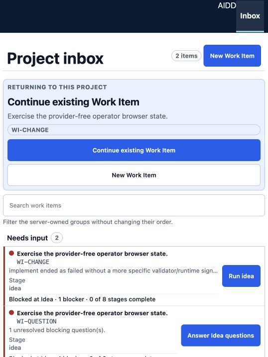
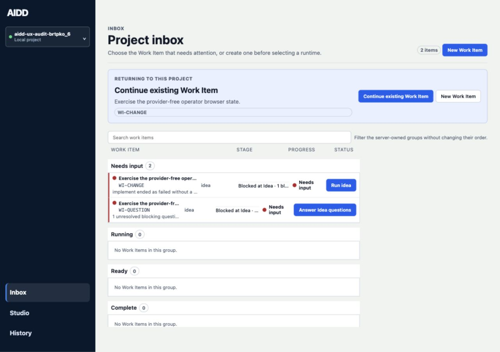
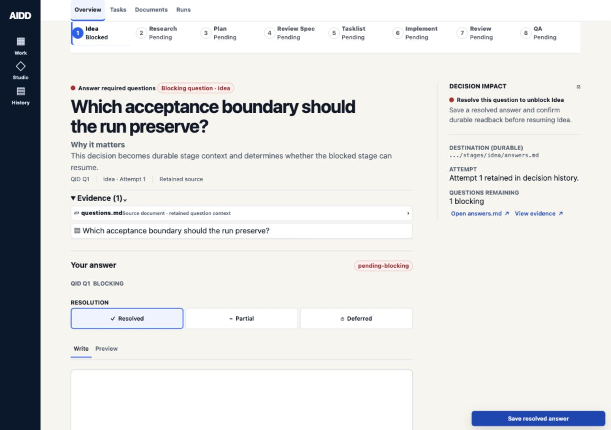
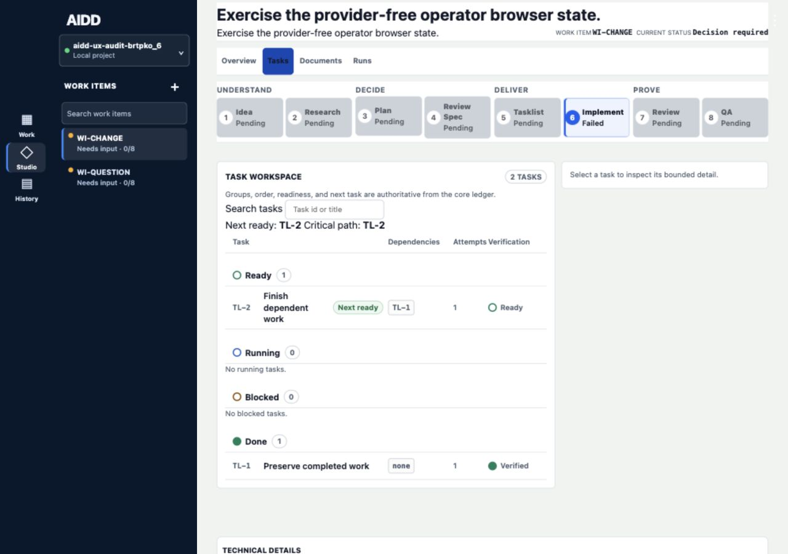
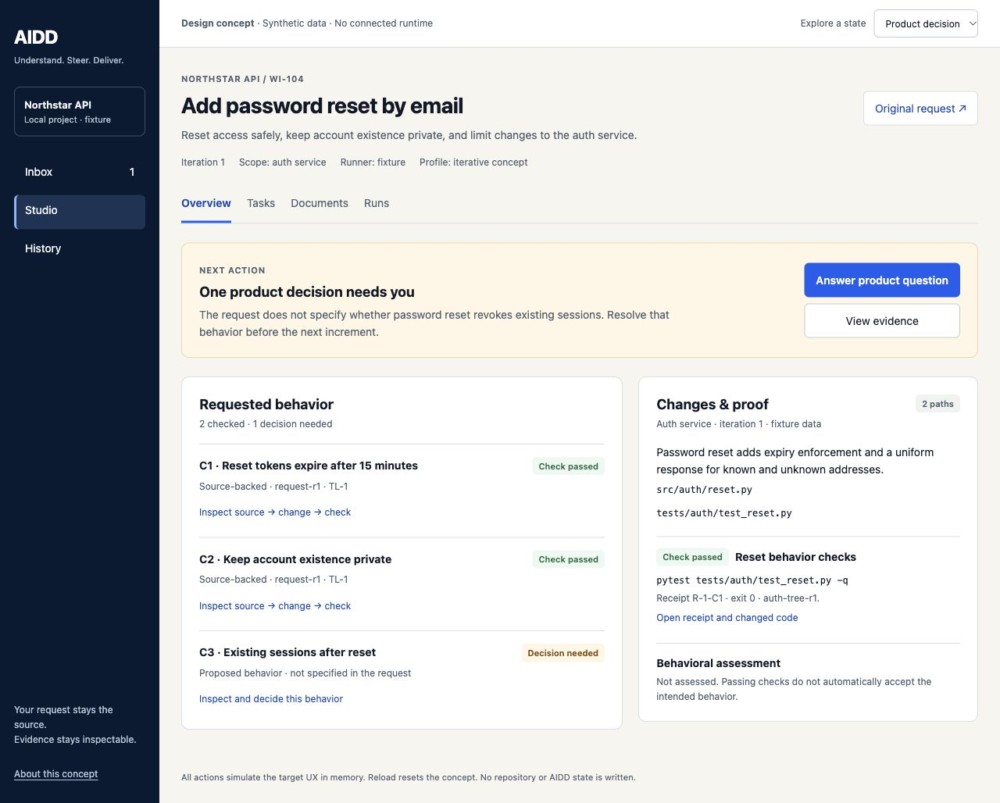

# Iterative Operator design concept

Status: design reference for `W57-E1-S1-T3`, recorded on 2026-10-01.
The [positioning](../../product/product-positioning.md) and
[UX blueprint](../../architecture/iterative-operator-ux.md) own the direction.
This bundle makes the interaction reviewable; it is not the production frontend,
runtime evidence, a usability study, or proof that this is the best design.

## Open and explore

Open [index.html](index.html), or serve the repository on loopback:

```bash
python3 -m http.server 57233 --bind 127.0.0.1
```

Then open `http://127.0.0.1:57233/docs/design/iterative-operator/`.
The concept uses the existing `operator-tokens.css` palette and scales. It makes no
API requests, launches no provider, writes no AIDD/repository state, and stores no
answers outside the page. Reload resets its synthetic fixture.

Try these bounded paths:

1. **Product decision:** inspect the original request, answer the session-policy question,
   save, notice that execution is still paused, explicitly start the simulated iteration,
   load its separate fixture check result, and review the intended behavior.
2. **Failed check:** select Failed check; inspect the failed receipt; prepare repair;
   start the simulated iteration; load the new result. History retains the earlier failure
   and its receipt identity. Failed/Stale fixtures preload a synthetic D-3 decision;
   the UI labels it as fixture data, not an answer made by the current operator.
3. **Stale proof:** select Stale proof; compare the 10-minute current requirement with the
   15-minute older check; prepare replan; load separate receipts after the execution preview.
4. **Review:** record a simulated assessment or request change. A recorded assessment
   leaves terminal QA/handoff pending and never puts the Work Item in Complete. A change
   request makes affected proof stale; further child iterations are outside this concept.
5. **Inspect:** use Inbox, Studio, History, and Overview / Tasks / Documents / Runs; open
   criterion source/change/receipt records. Evidence is synthetic and explicitly labeled.

The execution preview and Load fixture check result action deliberately expose the
simulation boundary. Production work must use the shared core projection and actual
receipts, never this local state machine. Create/launch, runtime permissions, full live
logs, multiple simultaneous jobs, and durable saving are specified in the blueprint but
are not implemented by this bounded concept.

## Bounded audit of the current UI

Scope: current Inbox, blocking-question recovery, and implementation task workspace.
Captured and visually inspected in this work session on 2026-10-01, using the code at
`9eb2aad4` (`0.1.0a27.dev0`) plus documentation/design changes only. The actual current
Operator UI was served from temporary deterministic fixtures:

- `build_browser_state_fixture(..., "implementation-task-failed")`, `WI-CHANGE / run-change`;
- `build_browser_state_fixture(..., "blocking-question")`, `WI-QUESTION / run-question`;
- readiness reports were stubbed empty; provider readiness and native execution were not tested.

The synthetic implementation fixture intentionally omits earlier successful stages. Its
run-global “Run idea” and task-local “TL-2 ready” are different scopes; these captures do
not establish that real complete runs have an eligibility bug. Test titles/criteria are
generic, so no claim about real task comprehension follows from their wording.

### Step 1 — choose a Work Item in Inbox

Health: **good foundation, limited outcome visibility**.
The UI prioritizes Needs input and provides explicit question/run actions. Returning work,
search, and group labels are discoverable. The list also gives prominent stage and “0 of 8”
progress facts while the broader requested behavior and proof are not represented there.
At the default narrow width, returning-work controls occupy much of the first view; broad
desktop retains the full project/navigation rail.

Target implication: retain core-owned groups and next actions; prioritize the outcome and
concrete blocker, and use criterion coverage inside Studio. Do not turn iterative work
into a misleading universal stage count.





### Step 2 — answer a blocking question

Health: **clear authority and recovery, room to reduce reading burden**.
The question is prominent; Why it matters, retained source, destination, attempt identity,
resolution, and durable-readback consequence are available. This is a strong foundation
for a scoped decision. The focused recovery view also presents the canonical stage strip,
multiple resolution controls, and document-oriented details. The fixture's business
consequence remains generic; that is a limitation of this sample, not an observed
behavior defect.

Target implication: preserve source and saving semantics; lead with the specific affected
behavior and consequence. Put optional evidence links, advanced resolution, and raw
destinations behind contextual disclosure while keeping the important decision visible.



### Step 3 — inspect implementation tasks after failure

Health: **good execution control, proof meaning needs a clearer target view**.
The task workspace explicitly identifies core-owned groups/readiness, TL-2 as next ready,
TL-1 as done, dependencies, attempts, and verification labels. Selecting a task is the
route to bounded detail. The dominant overview here is task/stage progression; the screen
does not explain the difference between a retained report, independent check receipt,
and behavioral assessment at criterion level.

Target implication: preserve the dependency ledger and completed work; link each behavior
to the exact changed code and current check, with freshness and assessment separate.
Reserve “verified” for its precise declared dimension.



## Concept visual reference and verification

The concept keeps the existing product vocabulary and palette, leads with the goal and
next scoped action, and shows criterion coverage beside changes/proof. A question does
not ask for blanket plan approval. Original source and proof chains are available on demand.



The rendered concept was inspected at desktop and narrow widths. The retained images
are design evidence only:

- [Product-decision panel](evidence/concept-decision.jpg).
- [Narrow Overview](evidence/concept-mobile.jpg).
- [Stale-proof state](evidence/concept-stale.jpg).

Final walkthrough on 2026-10-01:

| Check | Observed result |
| --- | --- |
| Product question → save → explicit start | Saved answer leaves execution paused; C3 is not checked until a separate fixture result is loaded. Both session-policy options were exercised across walkthroughs. |
| Fixture result → review → assessment | Passing receipts leave behavior unassessed; recording the simulated assessment leaves terminal QA/handoff pending. Inbox does not show Complete. |
| Failed check → repair plan → execution preview → new result | Failure remains visible until the separate run-2 receipts load; History still opens failed `R-1-C1` after the new result. |
| Stale proof | Current request says 10 minutes; retained code/receipt says 15. Preparing replan preserves the stale state and claims no new result. |
| Review → request change | Affected proof becomes stale; further child execution is explicitly outside this concept. |
| Source/evidence, Inbox/Studio/History and Work Item tabs | Contextual records and navigation render without calling a runtime or saving durable state. |
| Desktop 1280 × 720; narrow 390 × 844 | Screens visually inspected; narrow page and dialog have no document-level horizontal overflow. |
| Minimum-width 320 × 568 | Rendered Runs view has document width 320 with no horizontal overflow; not a complete journey at this size. |
| Keyboard | Arrow keys and Home/End change tabs with focused selection; Escape closes the modal and returns focus to its trigger. |
| Console and syntax | No error-level console entries in the concept session; `node --check docs/design/iterative-operator/concept.js` passed. |
| Documentation/planning | `uv run --extra dev pytest -q tests/test_planning_integrity.py tests/test_docs_consistency.py`: 70 passed. Local artifact links and task dependencies separately checked. |

No genuine first-time operator was observed. No production runtime, durable mutation,
CLI parity, screen-reader journey, or full WCAG audit was performed. This bounded audit
cannot close W42/W36 human observation or W59 migration acceptance tasks.

## Handoff

Keep the current production UI contract until the new data/authority contracts exist.
`W59-E1-S1-T3` implements the cards/inspector from a core projection;
`W59-E1-S1-T4` exposes saved-answer effects;
`W59-E1-S2-T1/T2` implement lineage and originating-context safety.
Real operator comparisons in `W59-E2-S1-T2` must test understanding and recovery before
the design is treated as accepted usability evidence. See the blueprint for complete
states, accessibility behavior, and acceptance tasks.
